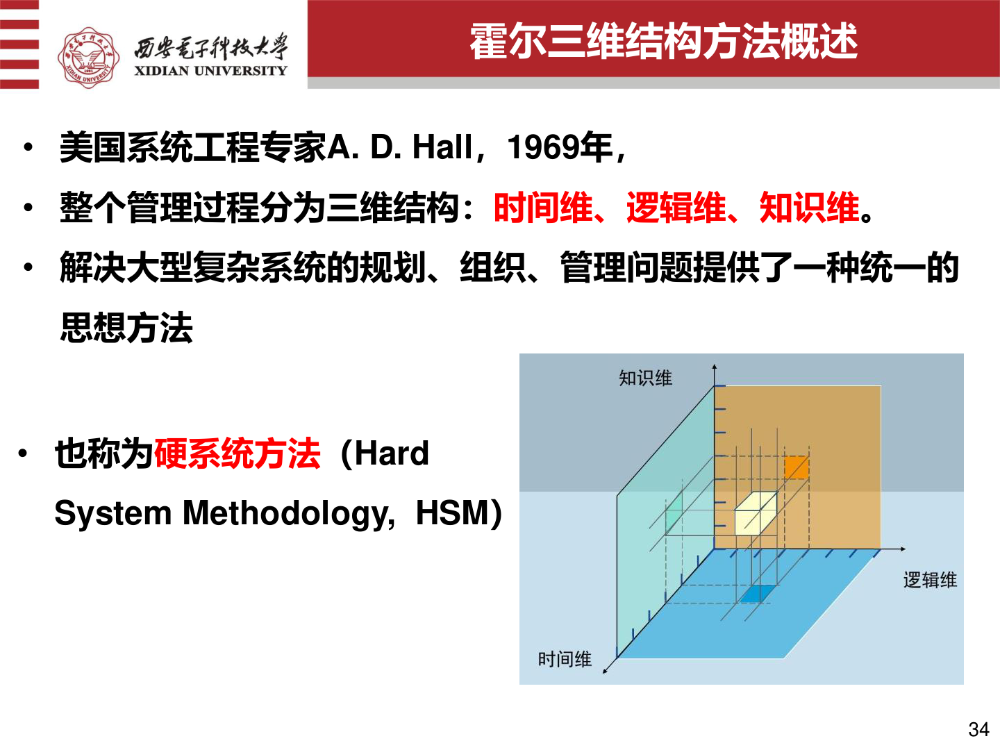
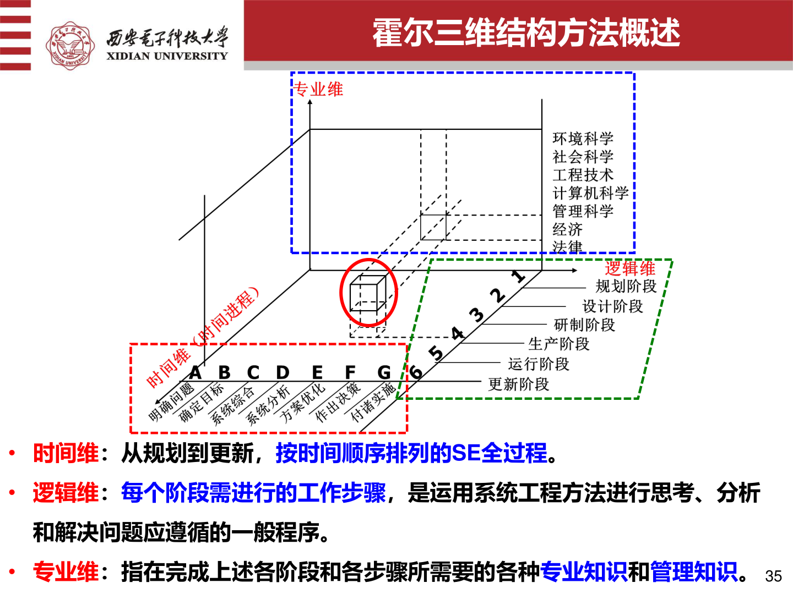
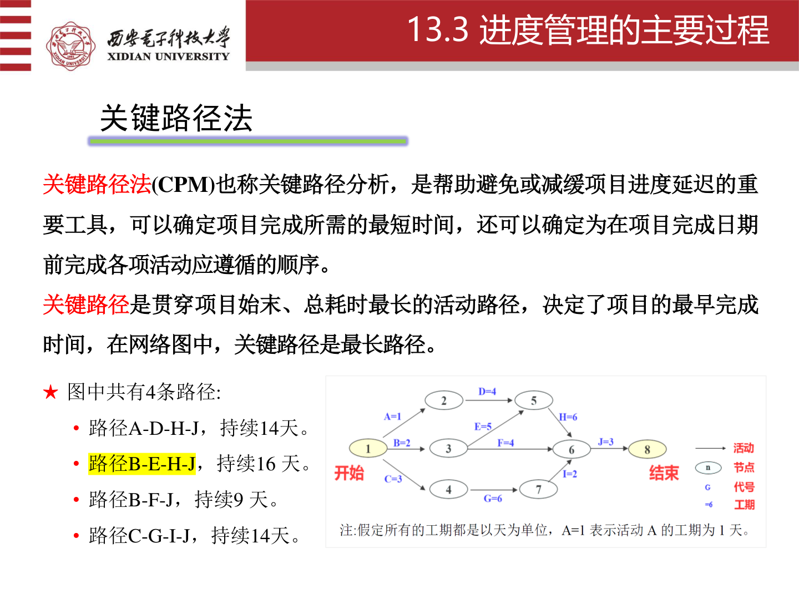

# 工程概论详细知识点复习

## 标记说明

- `【重点】`：原课件中反复出现、公式化、总结化、明显需要重点记住的内容
- `【次重点】`：和核心考点关系紧密，常作为理解、比较、补充或延伸出现的内容
- `【一般】`：课件中出现但通常不是本章最核心的内容
- `核心简短记忆要点`：只给重点且内容较长、较难记的知识点补充，位置紧跟在对应知识点后面

## 一、工程、工程师与复杂工程问题

### 【重点】 工程的基本内涵
- 工程不是单纯的技术操作，而是在现实约束条件下，综合运用科学、技术、经济、管理、法律、伦理等知识解决实际问题的活动。
- 工程的典型特征：
  - 综合性
  - 实践性
  - 经验性
  - 风险性
  - 生态性

**核心简短记忆要点：**
- 【必背】工程 = 多约束下解决实际问题

### 【重点】 科学、技术、工程的区别
- 科学：
  - 主要任务是认识世界、发现规律
  - 侧重“为什么”
- 技术：
  - 主要任务是把原理变成方法、工艺和工具
  - 侧重“怎么做”
- 工程：
  - 主要任务是在复杂约束下组织资源、形成可落地解决方案
  - 侧重“怎样在现实中做成”

**核心简短记忆要点：**
- 【必背】科学讲规律，技术讲方法，工程讲落地

### 【重点】 工程师的核心要求
- 工程师不只要懂技术，还要有：
  - 系统思维
  - 工程经济意识
  - 质量意识
  - 风险意识
  - 安全意识
  - 社会责任感
  - 沟通协作能力

**核心简短记忆要点：**
- 【必背】工程师不只懂技术，还要懂质量、风险、沟通、责任

### 【重点】 复杂工程问题
- 复杂工程问题不是单一技术问题，而是同时受到：
  - 技术约束
  - 成本约束
  - 时间约束
  - 质量约束
  - 风险约束
  - 法律伦理约束
  - 环境与社会约束

**核心简短记忆要点：**
- 【核心记忆】复杂工程问题 = 多目标 + 多约束 + 多学科

### 【次重点】 工程活动的综合性
- 因为工程最终是要在社会环境中交付并运行的。
- 单纯技术上“能做”不等于工程上“能实施、能合规、能盈利、能长期运行”。

### 【次重点】 工程师思维与技术思维、产品思维
- 技术思维看重功能、性能、实现。
- 产品思维看重需求、体验、价值、闭环。
- 工程思维看重流程、机制、质量、风险、成本和交付。

### 【一般】 工程起源和历史案例
- 都江堰、长城、青藏铁路、阿波罗计划等更多用于说明工程活动的规模性、系统性和社会性。

### 本章题目与参考答案

1. 题目：科学、技术、工程三者有什么区别与联系？
   - 参考答案：科学讲规律，技术讲方法，工程讲在现实约束下做成事情。
   - 易错点：不要把三者写成完全独立无联系。
2. 题目：复杂工程问题为什么复杂？
   - 参考答案：多目标、多约束、多学科、多参与方。
   - 易错点：不要只答“因为技术难”。

## 二、产品开发与全流程、全周期思想

### 【重点】 产品开发的定义
- 产品开发从发现市场机会开始，到产品的生产、销售、交付、使用乃至退出结束。
- 它不是单一研发动作，而是一系列有组织活动的集合。

**核心简短记忆要点：**
- 【必背】产品开发不是单一研发动作

### 【重点】 全流程、全周期思想
- 全流程：从概念提出到交付应用的整个开发链条。
- 全周期：从产品产生到使用、维护、回收的整个生命周期。

**核心简短记忆要点：**
- 【必背】全流程看从需求到交付，全周期看从产生到回收

### 【重点】 传统模式 vs 全流程模式
- 传统模式：
  - 以技术为中心
  - 容易忽略制造、安装、维护、服务、回收等环节
- 全流程模式：
  - 在概念阶段就考虑市场、冲突约束和兼容性
  - 在计划阶段进行经济决策和开发价值判断
  - 在开发阶段关注可制造性、可安装性、可维护性、可靠性
  - 在验证阶段进行系统性测试

**核心简短记忆要点：**
- 【核心记忆】复杂工程问题必须提前考虑“市场、成本、制造、维护、回收”

**核心简短记忆要点：**
- 【必背】传统模式只看技术，全流程模式看全链条

### 【重点】 产品开发绩效的常见维度
- 产品质量
- 产品成本
- 开发时间
- 开发成本
- 开发能力

### 【次重点】 全流程、全周期思想的意义
- 因为很多失败不是技术本身失败，而是需求判断、成本控制、质量验证、法律合规或后期运维失败。

### 【次重点】 IPD（集成产品开发）模式
- IPD强调市场导向、客户需求、并行工程和跨部门协同。
- 它不是只优化某一环节，而是优化整体开发过程。

### 【一般】 模糊前端阶段
- 重点在于形成高质量新设想，并决定是否正式启动开发。

### 本章题目与参考答案

1. 题目：全流程、全周期思想为什么重要？
   - 参考答案：因为前期决策会影响后续设计、制造、运维、回收。
   - 易错点：不要只答“因为流程很多”，要写出链条影响。
2. 题目：传统模式和全流程模式有什么区别？
   - 参考答案：一个偏技术中心，一个强调全链条协同。
   - 易错点：不要漏掉市场、制造、维护这些环节。

## 三、系统思想、系统工程与系统分析

### 【重点】 系统思想
- 强调整体性、关联性、层次性、动态性。
- 不能只看某个局部最优，而要看整体目标是否实现。

**核心简短记忆要点：**
- 【必背】系统思想 = 不能只看局部

### 【重点】 系统工程
- 系统工程是用于规划、设计、实现、运行和管理复杂系统的跨学科方法。
- 它强调：
  - 从整体出发
  - 目标导向
  - 多学科协同
  - 全寿命周期考虑

**核心简短记忆要点：**
- 【必背】系统工程 = 用系统方法解决复杂工程

### 【重点】 系统分析
- 系统分析的核心任务是：
  - 明确问题
  - 确定目标
  - 建立模型
  - 形成备选方案
  - 比较评价并优化选择

**核心简短记忆要点：**
- 【必背】系统分析 = 明确问题 -> 定目标 -> 建模型 -> 出方案 -> 选方案

### 【重点】 霍尔三维结构
- 霍尔三维结构是系统工程方法的重要框架。
- 课件明确写出霍尔三维结构包括：
  - 时间维
  - 逻辑维
  - 专业维（知识维）
- 其中：
  - 时间维：从规划到更新，按时间顺序排列的全过程
  - 逻辑维：每个阶段要进行的工作步骤，是分析和解决问题应遵循的一般程序
  - 专业维（知识维）：完成各阶段和各步骤所需要的各种专业知识和管理知识





**核心简短记忆要点：**
- 【核心记忆】霍尔逻辑维就是解决问题的一般步骤

### 【次重点】 系统工程与复杂工程问题
- 因为复杂工程问题涉及多目标、多约束、多环节、多利益相关方，必须用系统方法统筹。

### 【次重点】 确定目标时应注意什么
- 目标要明确
- 要区分主次、轻重、缓急
- 要平衡先进性与可行性
- 要考虑标准化
- 指标不宜过多，计算不宜过繁

### 【一般】 WSR 方法论
- 可作为扩展知识，考试更常考的是它“强调从意图、关系、行动过程去理解复杂问题”的思想，而不是特别细的流程名称。

### 本章题目与参考答案

1. 题目：什么是系统工程？什么是系统分析？
   - 参考答案：一个是跨学科方法，一个是建模、比较、评价和优选过程。
   - 易错点：不要把两者完全等同。
2. 题目：霍尔三维结构中逻辑维表示什么？
   - 参考答案：表示解决问题时应遵循的一般步骤和程序。
   - 易错点：不要把逻辑维和时间维、专业维混淆。

## 四、工程伦理

### 【重点】 工程伦理的核心
- 工程不仅是技术问题，也是道德问题。
- 工程伦理的首要原则是：
  - 把公众安全、健康、福祉和生态环境保护放在首位。

**核心简短记忆要点：**
- 【必背】工程伦理核心 = 公众安全、健康、福祉优先

### 【重点】 工程伦理关注的主要矛盾
- 成本与安全
- 进度与质量
- 效率与责任
- 企业利益与公众利益

**核心简短记忆要点：**
- 【必背】伦理冲突多发生在成本、进度、质量、安全之间

### 【重点】 责任冲突的处理原则
- 公众利益优先
- 主动预防风险优先于事后追责
- 借助透明沟通和制度设计化解矛盾

**核心简短记忆要点：**
- 【核心记忆】伦理题最稳的答案就是“公众利益优先”

### 【次重点】 工程伦理与案例问题
- 因为伦理并不是抽象口号，而是在具体工程决策里体现。
- 典型案例的考法通常是：
  - 这个案例暴露了什么伦理失误
  - 哪项原则被忽视

### 【一般】 挑战者号、福岛等案例
- 不必背事件细节，但要会说它们说明了“忽视安全、沟通失效、责任判断偏差”的后果。

### 本章题目与参考答案

1. 题目：工程伦理的核心原则是什么？
   - 参考答案：公众安全、健康、福祉和生态环境优先。
   - 易错点：不要只答“讲道德”。
2. 题目：工程伦理为什么会和案例题结合考？
   - 参考答案：因为伦理问题常体现在具体决策冲突中。
   - 易错点：不要只背案例细节，不说原则。

## 五、工程与法律法规

### 【重点】 法与法律
- 法：通过规范人的行为调整社会关系，以维护正义秩序。
- 法律：由有立法权的国家机关依照程序制定和颁布的规范。

### 【重点】 工程中的合规意识
- 工程活动必须在法律框架内进行。
- 合规性是技术可行性的前提，而不是事后补充条件。

**核心简短记忆要点：**
- 【必背】合规不是附加项，而是前提

### 【重点】 重点范围
- 法律基础知识
- 知识产权
- 产品开发与法律责任

**核心简短记忆要点：**
- 【必背】知识产权、产品责任、相关法规都会直接影响项目能否实施

### 【次重点】 工程中的法律约束
- 因为工程成果要进入市场、面向用户、承担责任。
- 只从技术上看“做得出来”，不等于法律上“可以做、可以卖、可以承担后果”。

**核心简短记忆要点：**
- 【核心记忆】技术上能做，不等于法律上能做

### 【一般】 手机进网许可、专利案例
- 主要是帮助理解“合规”和“知识产权”在工程活动中的现实约束。

### 本章题目与参考答案

1. 题目：法律合规与技术可行性的关系是什么？
   - 参考答案：技术上能做不等于法律上能做、能卖、能承担责任。
   - 易错点：不要只答“因为法律重要”。
2. 题目：工程活动中为什么要重视知识产权？
   - 参考答案：关系到成果使用、转化和责任承担。
   - 易错点：不要只把知识产权当作“专利”一种。

## 六、工程与标准化

### 【重点】 标准化的意义
- 标准化能保证一致性、兼容性、互换性和资源共享。
- 产品满足标准往往是进入市场的前提。

**核心简短记忆要点：**
- 【必背】标准化保证一致性、兼容性、互换性

**核心简短记忆要点：**
- 【核心记忆】标准化是产品进入市场的重要前提

### 【重点】 标准的分类
- 国际标准
- 国家标准
- 行业标准
- 地方标准
- 团体标准
- 企业标准

**核心简短记忆要点：**
- 【必背】标准分类：国际、国家、行业、地方、团体、企业

### 【重点】 标准与标准化
- 标准：统一规定
- 标准化：制定、发布、实施和管理标准的过程

### 【次重点】 标准与技术法规的区别
- 标准偏统一技术要求和协调
- 技术法规更具强制性，常与安全、环保等要求相关

### 【次重点】 标准化的意义
- 没有标准，产品一致性、兼容性、质量控制和进入应用环节都会出问题。

### 本章题目与参考答案

1. 题目：标准化在工程实践中的作用是什么？
   - 参考答案：保证一致性、兼容性、互换性和共享。
   - 易错点：不要只写“方便管理”。
2. 题目：标准和标准化有什么区别？
   - 参考答案：标准是规定，标准化是制定和实施这些规定的过程。
   - 易错点：不要把两者混为同义词。

## 七、环境与可持续发展

### 【重点】 环境的定义
- 环境是影响人类生存和发展的各种天然因素和人工改造因素的总体。

**核心简短记忆要点：**
- 【必背】环境不仅是自然，也包括人工改造因素

### 【重点】 环境问题
- 环境问题通常指环境质量下降、生态失调及其对人类的反作用。

### 【重点】 可持续发展
- 工程活动不能只追求眼前经济利益，还要兼顾长期生态、社会与资源平衡。

**核心简短记忆要点：**
- 【必背】可持续发展强调经济、社会、环境三者平衡

**核心简短记忆要点：**
- 【核心记忆】工程不能只看短期收益

### 【次重点】 工程与可持续发展的关系
- 工程是推动社会发展的力量，但如果忽视生态和资源约束，也会反向制造环境危机。

### 【一般】 十大环境污染事件
- 主要用来支撑“工程活动必须考虑环境后果”这个结论。

### 本章题目与参考答案

1. 题目：环境问题的实质是什么？
   - 参考答案：环境质量下降、生态失调及其对人类的反作用。
   - 易错点：不要只答“有污染”。
2. 题目：工程与可持续发展是什么关系？
   - 参考答案：工程推动发展，但必须兼顾资源、环境和长期影响。
   - 易错点：不要只从经济收益角度回答。

## 八、工程经济决策基础

### 【重点】 工程经济分析
- 从市场和经济效果角度，对工程项目及其备选方案进行分析、论证和评价。

**核心简短记忆要点：**
- 【必背】工程经济分析 = 先算值不值得做

**核心简短记忆要点：**
- 【核心记忆】经济分析越早做，越能避免大错

### 【重点】 项目论证的意义
- 判断项目是否值得实施
- 为项目决策提供依据

**核心简短记忆要点：**
- 【必背】项目论证是立项前的重要依据

### 【重点】 工程经济决策常看什么
- 成本
- 收入
- 利润
- 投资回收
- 经济效益

### 【次重点】 工程经济分析的前期作用
- 早期决策错误会导致后续大规模资源浪费，经济分析可以降低投资失误风险。

### 本章题目与参考答案

1. 题目：为什么项目早期就要做工程经济分析？
   - 参考答案：可减少投资失误，尽早判断项目是否值得实施。
   - 易错点：不要只答“为了省钱”。
2. 题目：项目论证的作用是什么？
   - 参考答案：判断项目是否值得实施，为决策提供依据。
   - 易错点：不要把项目论证写成项目执行控制。

## 九、项目经济评价与多方案比选

### 【重点】 项目经济评价的定义
- 从企业自身角度，对项目直接效益与直接费用进行比较，以衡量项目经济效果并为投资决策提供依据。

### 【重点】 经济评价指标分类
- 价值型指标：
  - 净现值
  - 费用年值
- 时间型指标：
  - 投资回收期
- 效率型指标：
  - 投资收益率
  - 净现值指数
  - 内部收益率

- 课件还明确按是否考虑资金时间价值分为：
  - 静态评价指标：如投资收益率、静态投资回收期
  - 动态评价指标：如净现值、净现值率、获利指数、内部收益率

### 【重点】 静态评价指标与动态评价指标
- 静态评价指标：
  - 通常不考虑资金时间价值
- 动态评价指标：
  - 考虑资金时间价值

**核心简短记忆要点：**
- 【必背】静态指标不看时间价值，动态指标看时间价值

### 【重点】 多方案比较的一般思路
- 先用绝对经济效果方法筛选
- 再用相对经济效果方法优选
- 比选时要有清晰顺序和统一标准

### 【重点】 常见经济评价指标与公式
净现金流量：

```text
NCF = CI - CO
```

量的含义：
- `NCF`：净现金流量
- `CI`：现金流入
- `CO`：现金流出

净现值：

```text
NPV = Σ [NCFt / (1 + i)^t]
```

量的含义：
- `NPV`：净现值
- `NCFt`：第 `t` 年净现金流量
- `i`：折现率或基准收益率
- `t`：年份序号

内部收益率 IRR：

- 含义：使 `NPV = 0` 时对应的折现率
- 判定：若 `IRR ≥ 基准收益率`，方案通常可行

投资回收期 PBT：

- 含义：累计净现金流量由负转正所需要的时间
- 常见的是静态投资回收期：不考虑资金时间价值
- 一般以“年”为单位

```text
Σ(CI - CO)t = 0
```

- 其中：
  - `Pt` 表示投资回收期
  - `CI` 表示现金流入量
  - `CO` 表示现金流出量

投资回报率 ROI：

```text
ROI = 年均净收益 / 总投资额 × 100%
```

量的含义：
- `ROI`：投资回报率
- 年均净收益：项目平均净收益
- 总投资额：项目初始及相关总投入

**核心简短记忆要点：**
- 【必背】PBT 看回本，ROI 看盈利率，NPV 看经济效果，IRR 看内部收益率
- 【核心记忆】互斥方案冲突时通常按 NPV 选

### 【次重点】 经济评价指标的比较性
- 因为不同指标关注的角度不同，考试常要求你判断某指标属于哪一类、适合解决什么问题。

### 【次重点】 各指标分别回答什么问题
- PBT：多久回本
- ROI：盈利能力有多强
- NPV：项目经济效果是否为正、效果大小如何
- IRR：项目内部收益率是否达到要求

### 本章题目与参考答案

1. 题目：PBT、ROI、NPV、IRR 分别回答什么问题？
   - 参考答案：回本时间、盈利率、经济效果、内部收益率。
   - 易错点：不要把静态和动态指标混写。
2. 题目：为什么互斥方案冲突时通常按 NPV 选？
   - 参考答案：NPV 更适合比较不同方案的总经济效果。
   - 易错点：不要只写“因为 NPV 更准”。

## 十、项目管理概述

### 【重点】 项目的定义
- 项目是为创造独特的产品、服务或成果而进行的临时性工作。

### 【重点】 项目的属性
- 独特性
- 临时性
- 目标导向

**核心简短记忆要点：**
- 【必背】项目 = 临时性 + 独特性 + 目标导向

### 【重点】 项目的约束
- 范围
- 时间
- 成本

现实中还常扩展到：
- 质量
- 风险
- 资源

**核心简短记忆要点：**
- 【必背】三大约束 = 范围、时间、成本

### 【重点】 项目管理五大过程组
- 启动
- 规划
- 执行
- 监控
- 收尾

**核心简短记忆要点：**
- 【必背】五大过程组 = 启动、规划、执行、监控、收尾

**核心简短记忆要点：**
- 【核心记忆】项目管理就是在约束中把事做成

### 【次重点】 项目管理在工程活动中的适用性
- 因为工程活动通常目标明确、资源有限、周期有限，而且存在多方协同和不确定性。

### 本章题目与参考答案

1. 题目：项目有什么基本属性？
   - 参考答案：独特性、临时性、目标导向。
   - 易错点：不要把项目和日常运营活动混淆。
2. 题目：项目管理五大过程组是什么？
   - 参考答案：启动、规划、执行、监控、收尾。
   - 易错点：顺序不要写错。

## 十一、项目启动与范围管理

### 【重点】 项目启动
- 项目启动标志着项目正式开始。
- 在启动前通常要进行项目论证和可行性评估。

**核心简短记忆要点：**
- 【必背】启动 = 项目正式开始

### 【重点】 项目章程
- 项目章程可以是专门文件，也可以由需求说明书、成果说明书、合同等替代。
- 课件中还明确写出：
  - 项目章程是正式承认项目存在的文件
  - 该文件赋予项目经理利用资源、从事有关活动的权力
- 它的作用是正式授权项目启动。

**核心简短记忆要点：**
- 【必背】项目章程 = 正式授权文件

### 【重点】 范围管理的核心问题
- 回答“什么必须做”，而不是“什么都可以做”

**核心简短记忆要点：**
- 【必背】范围管理核心问题 = 什么必须做

### 【次重点】 范围管理的基础性
- 不先明确做什么，就无法进一步规划进度、成本和资源。

**核心简短记忆要点：**
- 【核心记忆】范围不清，后面进度和成本都没法规划

### 本章题目与参考答案

1. 题目：项目章程的作用是什么？
   - 参考答案：正式承认项目存在并授权项目启动。
   - 易错点：不要把项目章程写成详细实施计划。
2. 题目：为什么范围是后续规划的基础？
   - 参考答案：不明确做什么，就没法规划进度、成本和资源。
   - 易错点：不要把范围管理答成质量管理。

## 十二、项目规划与进度管理

### 【重点】 项目规划
- 项目规划是在正式执行前，为实现目标制定行动方案的过程。

### 【重点】 规划之间的依赖关系
- 先明确范围
- 再规划进度
- 再规划成本

### 【次重点】 进度管理与范围的关系
- 范围越大，任务越多，进度安排越复杂。

**核心简短记忆要点：**
- 【必背】先有范围，后有进度，再有成本



### 本章补充记忆要点

- 【核心记忆】不知道做什么，就不可能知道多久做完

### 本章题目与参考答案

1. 题目：范围、进度、成本三者的先后约束关系是什么？
   - 参考答案：因为工作内容决定任务量，任务量影响时间和成本。
   - 易错点：不要把先后关系答反。
2. 题目：进度管理为什么容易受范围影响？
   - 参考答案：范围越大，任务越多，安排越复杂。
   - 易错点：不要只答“因为项目复杂”。

## 十三、项目成本管理

### 【重点】 项目成本管理定义
- 为使项目在批准预算内完成，对成本进行规划、估算、预算、融资、筹资、控制的管理过程。

**核心简短记忆要点：**
- 【必背】成本管理四过程 = 规划、估算、预算、控制

### 【重点】 项目成本管理的四个主要过程
- 规划成本管理
- 估算成本
- 制定预算
- 控制成本

### 【次重点】 项目成本管理与项目经济分析的区别
- 项目经济分析更偏前期投资立项与可行性决策
- 项目成本管理更偏项目执行全过程的预算与控制

**核心简短记忆要点：**
- 【必背】项目经济分析偏前期决策，成本管理偏执行控制

### 本章补充记忆要点

- 【核心记忆】折旧不直接花现金，但会影响净现金流

### 本章题目与参考答案

1. 题目：项目成本管理和项目经济评价有什么区别？
   - 参考答案：一个偏前期可行性决策，一个偏执行过程控制。
   - 易错点：不要把两者写成同义词。
2. 题目：为什么折旧不直接等于现金流出？
   - 参考答案：折旧是成本分摊，不是当期直接支付现金。
   - 易错点：不要漏掉它会间接影响净现金流这一点。

## 十四、项目质量与风险管理

### 【重点】 质量管理
- 质量管理不是单纯事后检查，而是通过计划、过程和控制确保项目输出达到要求。

**核心简短记忆要点：**
- 【必背】质量管理不只是事后检查，而是全过程保证质量

### 【重点】 风险管理
- 风险管理的核心是识别、分析、应对和控制不确定性带来的损失可能。

**核心简短记忆要点：**
- 【必背】风险管理七过程主线 = 识别 -> 分析 -> 应对 -> 跟踪

**核心简短记忆要点：**
- 【必背】风险管理计划管方法，风险登记册管具体风险

### 【重点】 执行、监控、收尾
- 执行：协调资源和活动以实现目标
- 监控：跟踪、审查、调整项目进展与绩效
- 收尾：正式结束项目或阶段，总结经验教训

### 【重点】 风险管理七过程
- 规划风险管理
- 识别风险
- 实施定性风险分析
- 实施定量风险分析
- 规划风险应对
- 实施风险应对
- 监督风险

### 【重点】 七种基本质量工具
- 检查表：收集数据
- 因果图：分析原因
- 帕累托图：抓主要矛盾
- 控制图：判断过程是否异常
- 流程图：描述过程逻辑
- 直方图：看分布特征
- 散点图：看变量相关性
- 这里要特别记住是“七种”基本质量工具，考试容易直接考数量和名称

### 【次重点】 质量、成本、进度、风险的相互影响
- 因为提高质量往往需要更多成本和时间，而压缩时间又可能增加风险。

### 本章题目与参考答案

1. 题目：七种基本质量工具分别用来做什么？
   - 参考答案：检查表收集数据、因果图找原因、帕累托抓重点等。
   - 易错点：不要把工具名称和用途错配。
2. 题目：风险管理计划和风险登记册有什么区别？
   - 参考答案：一个规定风险怎么管，一个记录具体风险及应对。
   - 易错点：不要写成两个都是“风险文档”就完了。

## 十五、综合题与参考答案

### 可能综合问到的内容

#### 1. 跨章节综合题

1. 科学、技术、工程三者的区别与联系是什么？它们如何共同作用于复杂工程问题？
2. 为什么复杂工程问题必须坚持全流程、全周期思维？
3. 项目范围、进度、成本、质量、风险之间是什么关系？
4. 工程伦理、法律法规、标准化为什么属于工程活动的内在约束？

#### 2. 综合方法题

1. 互斥方案比较时，为什么 NPV 与 IRR 冲突通常按 NPV 选？
2. 敏感性分析的一般步骤是什么？它的局限性是什么？
3. 项目章程、范围说明书、WBS 三者有什么关系？
4. 关键路径为什么决定最早完工时间？

### 回答主线

#### 1. 课件显式案例怎么答

- 丁谓修宫：
  - 说明系统思想、整体优化、联动解决问题
- 两点之间交通运输方式选择：
  - 说明系统分析与霍尔三维结构
- 新产品开发案例：
  - 说明全流程、全周期思想
- 净现值/指标选择题：
  - 说明资金时间价值与指标适用范围

#### 2. 综合题答法模板

- 先下定义
- 再说明作用或意义
- 再补流程、分类或比较
- 若是方法题，再给步骤和判断标准

## 十六、易混点对比

| 易混点 | 核心区别 | 最短记忆法 |
|---|---|---|
| 科学 / 技术 / 工程 | 发现规律 / 形成方法 / 现实落地 | 规律-方法-落地 |
| 工程 / 产品 / 项目 | 活动更广 / 输出物 / 临时性工作 | 活动 / 结果 / 任务 |
| 标准 / 技术法规 | 一个偏统一规定，一个更具强制性 | 规定 vs 强制 |
| 静态指标 / 动态指标 | 不考虑时间价值 / 考虑时间价值 | 静态不折现，动态要折现 |
| 项目经济评价 / 项目成本管理 | 前期值不值得投 / 过程里怎么把钱管住 | 立项判断 vs 执行控制 |
| 风险管理计划 / 风险登记册 | 管方法 / 管具体风险 | 计划管法，登记册管风险 |

## 十七、复习节奏建议

### 建议顺序

1. 第一轮先看完整知识点
2. 第二轮只看 `核心简短记忆要点 + 本章题目与参考答案`
3. 第三轮重点看：
   - 科学/技术/工程
   - 系统工程方法
   - 标准化
   - 项目经济评价
   - 项目管理
4. 考前最后只扫：
   - 必背比较
   - 必背公式/规则
   - 综合题
