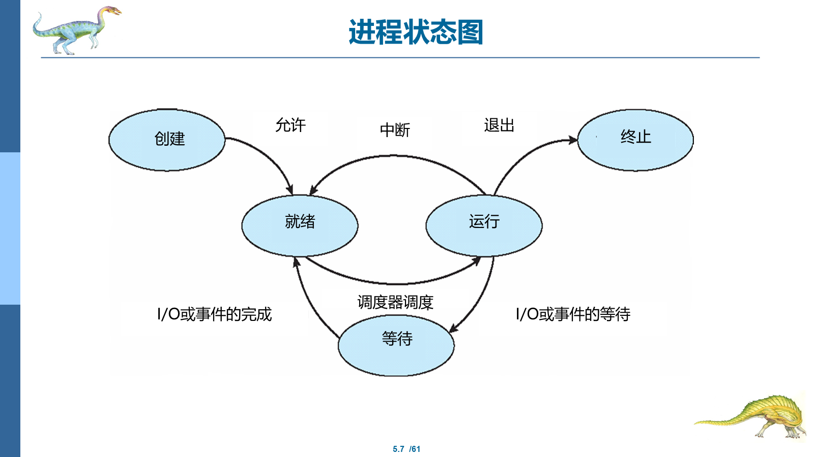
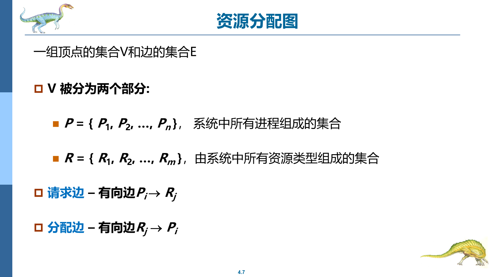
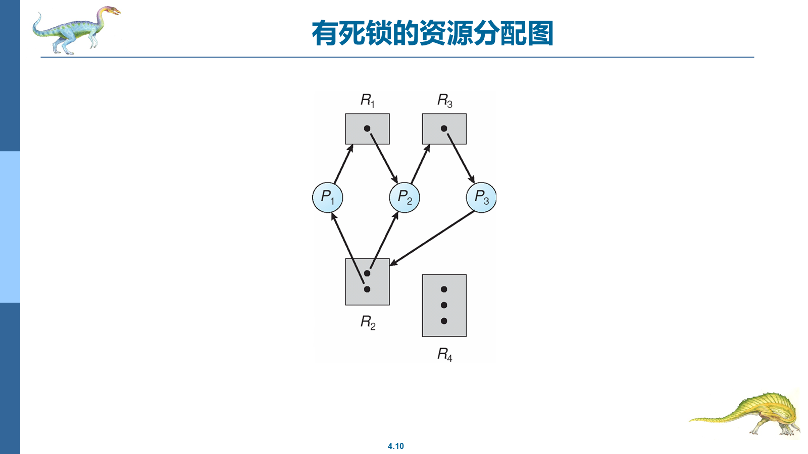
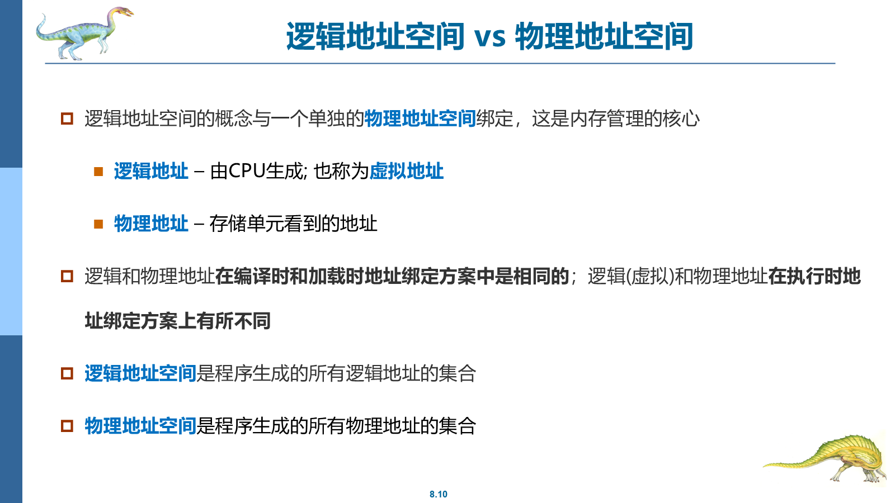
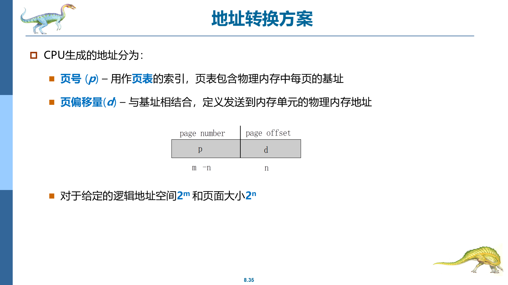

# 操作系统详细知识点复习

## 标记说明

- `【重点】`：原课件中反复出现、公式化、总结化、明显需要重点记住的内容
- `【次重点】`：和核心考点关系紧密，常作为理解、比较、补充或延伸出现的内容
- `【一般】`：课件中出现但通常不是本章最核心的内容
- `核心简短记忆要点`：只给重点且内容较长、较难记的知识点补充，位置紧跟在对应知识点后面

## 一、导论与操作系统基本概念

### 【重点】 操作系统是什么
- 课件明确强调：**操作系统是计算机的核心和灵魂**。
- 操作系统软件的设计与实现对整个计算机的功能和性能起关键作用。
- 课件里给出的两个重要理解角度：
  - 操作系统是**资源分配器**
  - 操作系统是**一直运行在计算机上的程序**，通常称为**内核**

### 【重点】 计算机系统的四个组件
课件中明确写出：
- 硬件：提供基本计算、存储资源
- 操作系统：控制和协调硬件的使用
- 应用程序：定义系统资源如何解决用户问题
- 用户

### 【重点】 操作系统的主要活动
从第一章课件中能整理出的高频活动：
- 进程管理
- 内存管理
- 存储管理
- 文件管理
- 保护与安全

### 【重点】 操作系统定义中的高频表述
- 管理所有资源
- 在应用程序和用户之间控制和协调硬件使用
- 在有效且公平地使用资源与冲突请求之间作出决定

**核心简短记忆要点：**
- 【必背】计算机系统四组件 = 硬件 / 操作系统 / 应用程序 / 用户
- 【必背】操作系统核心任务 = 管资源、控硬件、保公平

### 【次重点】 操作系统作为资源分配器
- 因为 CPU、内存、I/O 设备、文件、网络等资源都要由操作系统统一调度和分配。
- 当多个程序、多个用户同时运行时，操作系统需要决定谁先用、用多久、如何避免冲突。

**核心简短记忆要点：**
- 【核心记忆】操作系统核心任务是在“替很多程序协调抢资源”

### 【次重点】 操作系统作为核心和内核程序
- 因为没有操作系统，应用程序无法方便、稳定地使用硬件资源。
- 操作系统决定了资源管理方式、程序运行方式和整个系统的组织方式。

### 【一般】 课程背景和用途
- 课件明确说这门课对程序员、系统管理员都有帮助。
- 也强调它是计算机与相关专业的主干课程之一。

### 本章题目与参考答案

1. 题目：操作系统作为资源分配器的含义是什么？
   - 参考答案：它负责统一协调 CPU、内存、I/O、文件等资源。
   - 易错点：不要只答“因为它管理硬件”，要写资源分配与协调。
2. 题目：计算机系统的四个组件是什么？
   - 参考答案：硬件、操作系统、应用程序、用户。
   - 易错点：不要漏掉应用程序或用户。

## 二、操作系统服务、接口与结构

### 【重点】 操作系统提供的服务
课件明确列出：
- 用户界面（CLI、GUI、批处理界面）
- 程序执行
- I/O 操作
- 文件系统操作
- 通信
- 错误检测
- 资源分配
- 记账
- 保护与安全

**核心简短记忆要点：**
- 【必背】OS 服务 = UI + 执行 + I/O + 文件 + 通信 + 保护

### 【重点】 系统调用
- 系统调用是程序请求操作系统服务的接口。
- 课件中以 UNIX / Linux 的 `read()` 为标准 API 例子，说明应用程序通过 API 触发系统调用。

**核心简短记忆要点：**
- 【必背】系统调用 = 程序向内核要服务
- 【核心记忆】系统调用是“程序进内核办事”的门

### 【重点】 系统调用的类型
课件中直接列出的高频类别：
- 进程控制
- 文件管理
- 设备管理
- 信息维护
- 通信
- 保护

### 【重点】 系统程序
课件强调：
- 系统程序为应用程序开发和执行提供便利环境。
- 有的系统程序是系统调用的简单用户接口，有的更复杂。

### 【重点】 操作系统结构
课件里明确出现的结构和思路：
- 简单结构（如 MS-DOS）
- 层次结构（Layered Approach）
- 模块化架构（Modules）

### 【次重点】 用户接口和系统调用不是一回事
- 用户接口是人或程序接触系统的入口（CLI、GUI 等）
- 系统调用是程序进入内核服务的正式接口

### 【次重点】 层次结构的特点
- 每一层建立在更低层之上
- 底层靠近硬件
- 顶层靠近用户界面
- 有利于分工和实现复杂系统

### 【次重点】 模块化架构的理解
- 通过一组核心组件和可加载模块构建系统
- 相比“简单结构”，组织更清晰、扩展更方便

### 【一般】 GUI 与 CLI
- GUI 更直观
- CLI 更适合精确控制和脚本化

### 本章题目与参考答案

1. 题目：操作系统提供哪些主要服务？
   - 参考答案：UI、程序执行、I/O、文件系统、通信、错误检测、保护安全等。
   - 易错点：不要把资源分配、记账漏掉。
2. 题目：系统调用和用户界面有什么区别？
   - 参考答案：系统调用是程序向内核请求服务的接口，用户界面是人/程序接触系统的入口。
   - 易错点：不要把 CLI/GUI 当成系统调用。

## 三、进程

### 【重点】 程序 vs 进程
- 程序：存储在磁盘上的**被动实体**
- 进程：程序装入内存后形成的**主动实体**

**核心简短记忆要点：**
- 【核心记忆】进程就是“运行中的程序”

### 【重点】 进程状态
课件中的状态图反复出现，核心是：
- 创建（new）
- 运行
- 就绪
- 等待
- 终止（terminated）

- 课件中的典型状态转换还包括：
  - 创建 -> 就绪
  - 就绪 -> 运行
  - 运行 -> 等待
  - 等待 -> 就绪
  - 运行 -> 终止



### 【重点】 进程控制块 PCB
PCB 中包含：
- 进程状态
- 进程 ID
- 程序计数器
- 寄存器
- 调度信息
- 内存管理信息等

**核心简短记忆要点：**
- 【必背】PCB = 进程的管理档案

### 【重点】 进程调度目标
- 最大限度利用 CPU
- 在可接受的响应时间内在进程之间快速切换

**核心简短记忆要点：**
- 【必背】调度目标 = 提高 CPU 利用率 + 保证响应时间

### 【重点】 调度程序分类
- 短期调度程序（CPU 调度程序）
- 长期调度程序（作业调度程序）
- 中期调度程序（交换相关）

### 【重点】 进程分类
- I/O 密集型进程
- CPU 密集型进程

### 【次重点】 程序与进程的区别
- 程序只是静态文件
- 进程是程序执行时的动态存在，拥有状态、资源和执行现场

**核心简短记忆要点：**
- 【必背】程序是静态的，进程是动态的

### 【次重点】 I/O 密集型与 CPU 密集型进程
- 因为调度器要尽量兼顾系统效率和响应性
- 不同类型的进程对 CPU 和 I/O 的需求模式不同

### 【一般】 进程树
- 父进程可以创建子进程
- 子进程还能继续创建新的进程

### 本章题目与参考答案

1. 题目：程序和进程有什么区别？
   - 参考答案：程序是静态文件，进程是运行中的主动实体。
   - 易错点：不要把两者等同。
2. 题目：PCB 中通常保存哪些关键信息？
   - 参考答案：进程状态、进程 ID、程序计数器、寄存器、调度信息等。
   - 易错点：不要只写“保存进程信息”。

## 四、线程

### 【重点】 线程的定义
- 线程是 CPU 执行的基本单元
- 课件中明确说线程包含：
  - 程序计数器
  - 寄存器组
  - 栈
- 一个进程可以包含多个并行执行的线程

**核心简短记忆要点：**
- 【必背】线程是 CPU 执行的基本单元

### 【重点】 多线程的优势
- 进程中多个任务可分别由线程实现
- 某个任务阻塞时，其他任务还能继续
- 线程创建比进程创建更轻量

**核心简短记忆要点：**
- 【核心记忆】一个进程里可以有多个线程同时推进任务

### 【重点】 多核编程中的概念
- 并行性：真正同时执行多个任务
- 并发性：支持多个任务都取得进展

### 【重点】 Amdahl 定律
- 课件明确把它作为多核编程的性能分析工具。
- 课件给出：若程序中必须串行执行的部分为 `S`，系统有 `N` 个处理核，则加速比满足 Amdahl 定律。
- 核心结论：
  - 串行部分限制系统加速比
  - 处理核再多，也无法无限提升性能
- 若程序中必须串行执行的部分占比为 `S`，随着处理核数增加，加速比最终收敛到 `1/S`

```text
Speedup = 1 / (S + (1 - S) / N)
```

### 【重点】 多线程模型
- 用户线程
- 内核线程
- 多线程模型的组织方式

### 【次重点】 线程比进程更轻量的表现
- 因为同一进程内线程共享代码、数据和部分资源
- 不需要像新建进程那样重新分配完整资源环境

### 【次重点】 并行性和并发性的区别
- 并发：交替推进
- 并行：同时执行

### 【一般】 隐式多线程
- 由编译器和运行时库创建和管理线程，而不是程序员显式管理全部细节

### 本章题目与参考答案

1. 题目：为什么线程比进程更轻量？
   - 参考答案：线程共享进程内的代码、数据和部分资源。
   - 易错点：不要答成“线程就是小进程”。
2. 题目：并发和并行有什么区别？
   - 参考答案：并发是交替推进，并行是真正同时执行。
   - 易错点：不要把两者混成“都一样是一起执行”。

## 五、进程同步

### 【重点】 竞争条件
- 多个进程同时访问和操作相同共享数据时，结果取决于访问顺序，这就是竞争条件。

**核心简短记忆要点：**
- 【必背】竞争条件 = 结果依赖执行顺序

**核心简短记忆要点：**
- 【核心记忆】同步题核心就是“怎么保证共享数据不乱”

### 【重点】 临界区问题
- 临界区：进程执行时会访问共享数据的那段代码
- 要求：当一个进程在临界区中，其他进程不能同时进入各自临界区
- 课件中的典型代码结构还包括：
  - 进入区
  - 临界区
  - 退出区
  - 剩余区

### 【重点】 临界区解的三个条件
- 互斥
- 进步
- 有限等待

**核心简短记忆要点：**
- 【必背】临界区三条件 = 互斥、进步、有限等待

### 【重点】 Peterson 解决方法
- 面向两个进程
- 依赖两个共享数据项：
  - `turn`
  - `flag[2]`
- 其中：
  - `turn`：指示轮到哪个进程进入临界区
  - `flag[i]`：指示进程 `Pi` 是否想进入临界区

**核心简短记忆要点：**
- 【必背】Peterson 用 `turn + flag`

### 【重点】 硬件同步
- 课件强调现代机器提供特殊原子硬件指令支持同步

### 【重点】 信号量
- 是同步的经典工具
- 课件和实验都反复出现

**核心简短记忆要点：**
- 【必背】信号量和管程都是同步工具

### 【重点】 管程
- 作为更高级的同步抽象结构
- 管程中一次只能有一个进程处于活动状态

### 【次重点】 Peterson 解决方法的地位
- 它是经典软件同步方案
- 用来说明在不依赖复杂硬件条件下如何实现临界区互斥

### 【次重点】 管程作为更高级同步结构
- 因为它把同步约束封装进抽象结构中，减少直接误用

### 【一般】 内核中的临界区处理
- 非抢占式内核和抢占式内核在竞争条件处理上有差别

### 本章题目与参考答案

1. 题目：临界区问题的三个条件是什么？
   - 参考答案：互斥、进步、有限等待。
   - 易错点：顺序可不严格，但三个条件不能漏。
2. 题目：Peterson 解决方法依赖哪两个共享数据项？
   - 参考答案：`turn` 和 `flag[2]`。
   - 易错点：不要只写“两个标志位”。

## 六、CPU 调度

### 【重点】 CPU 调度的目标
- 提高 CPU 利用率
- 提高吞吐量
- 缩短周转时间
- 缩短等待时间
- 缩短响应时间

**核心简短记忆要点：**
- 【必背】调度看五个量：CPU 利用率、吞吐量、周转、等待、响应

**核心简短记忆要点：**
- 【核心记忆】调度的核心是“既高效又公平”

### 【重点】 调度发生的时机
课件给出四种典型情况：
- 运行 -> 等待
- 运行 -> 就绪
- 等待 -> 就绪
- 进程终止

### 【重点】 非抢占式与抢占式调度
- 非抢占式：进程运行后直到阻塞或结束才交出 CPU
- 抢占式：调度器可以中断当前进程并切换

### 【重点】 常见调度算法
- FCFS（First Come, First Serve）
- SJF（Short Job First）
- 优先级调度
- 轮询
- 多级队列
- 多级反馈队列

**核心简短记忆要点：**
- 【必背】FCFS、SJF、优先级、轮询必须认得

### 【重点】 调度准则中的几个核心量
- 周转时间：提交到完成的全部时间
- 等待时间：在就绪队列中等待 CPU 的时间
- 响应时间：提交请求到第一次响应的时间

**核心简短记忆要点：**
- 【必背】周转 = 从提交到结束；等待 = 在就绪队列里等；响应 = 第一次响应

### 【次重点】 抢占式调度的特点
- 因为可能在进程更新共享数据结构时打断进程，引发竞争条件

### 【次重点】 FCFS 的典型缺点
- 容易造成平均等待时间过长

### 【一般】 CPU-I/O 突发周期
- 许多进程在 CPU 计算和 I/O 等待之间交替进行

### 本章题目与参考答案

1. 题目：CPU 调度的常见准则有哪些？
   - 参考答案：CPU 利用率、吞吐量、周转时间、等待时间、响应时间。
   - 易错点：不要把周转、等待、响应混淆。
2. 题目：FCFS、SJF、优先级、轮询各属于什么思路？
   - 参考答案：先来先服务、最短作业优先、优先级高先执行、时间片轮转。
   - 易错点：不要把轮询写成非抢占。

## 七、死锁

### 【重点】 死锁的定义
- 两个或多个进程无限期等待某事件，而该事件只能由这些等待进程之一完成

### 【重点】 死锁四个必要条件
- 互斥
- 占有并等待
- 非抢占
- 循环等待
- 四个条件必须同时成立，死锁才可能发生

**核心简短记忆要点：**
- 【必背】死锁四条件必须整套背
- 【核心记忆】死锁题先写四条件，基本就拿到主体分

### 【重点】 资源分配图基本结论
- 图无环 -> 无死锁
- 图有环：
  - 若每种资源类型只有一个实例，则可能就是死锁
  - 若有多个实例，则有可能死锁，也可能不是





**核心简短记忆要点：**
- 【必背】图无环无死锁；图有环不一定有死锁

### 【重点】 处理死锁的方法
- 预防
- 避免
- 检测并恢复
- 忽略问题

**核心简短记忆要点：**
- 【必背】处理方法 = 预防 / 避免 / 检测恢复 / 忽略

### 【次重点】 死锁问题的复杂性
- 因为它常和资源竞争、锁、调度时机一起出现
- 在实际系统里可能不容易重现

### 【次重点】 死锁恢复中的进程终止
- 可一次终止所有死锁进程
- 也可一次终止一个进程，直到死锁消除

### 【一般】 银行家算法
- 属于避免死锁的经典方法

### 本章题目与参考答案

1. 题目：死锁四个必要条件是什么？
   - 参考答案：互斥、占有并等待、非抢占、循环等待。
   - 易错点：四个条件必须成套写。
2. 题目：图中有环就一定死锁吗？
   - 参考答案：不一定；若每类资源只有一个实例时才更容易直接推出死锁。
   - 易错点：不要一概而论“有环就死锁”。

## 八、内存管理

### 【重点】 基址寄存器和界限寄存器
- 一对寄存器定义逻辑地址空间
- CPU 需要检查用户模式下每次内存访问是否越界



### 【重点】 交换
- 进程可暂时从内存换到后备存储，再换回继续执行
- 换入换出时间主要由传输时间决定

**核心简短记忆要点：**
- 【必背】交换 = 内存与后备存储之间来回换

### 【重点】 分段
- 程序是段的集合
- 段是逻辑单元
- 段表项包含：
  - 验证位
  - 权限位
  - 段长度等信息

### 【重点】 分页
- 物理地址空间可不连续
- 物理内存划分为固定大小块，称为帧
- 主要优点：
  - 避免外部碎片



**核心简短记忆要点：**
- 【核心记忆】分页主要解决外部碎片问题

### 【次重点】 分段和分页的差别
- 分段按逻辑意义划分
- 分页按固定大小划分

**核心简短记忆要点：**
- 【必背】分段看逻辑单位，分页看固定大小块

### 【一般】 双缓冲
- 在 I/O 与交换限制讨论中出现，用于处理挂起 I/O 等问题

### 本章题目与参考答案

1. 题目：分段和分页有什么区别？
   - 参考答案：分段按逻辑单位划分，分页按固定大小划分。
   - 易错点：不要把“分段解决外部碎片”写反。
2. 题目：交换的基本思想是什么？
   - 参考答案：进程可以暂时换出到后备存储，再换回继续执行。
   - 易错点：不要把交换和虚拟内存完全等同。

## 九、虚拟内存

### 【重点】 虚拟内存的核心思想
- 用户逻辑内存与物理内存分离
- 程序不需要全部同时驻留内存

**核心简短记忆要点：**
- 【必背】虚拟内存 = 逻辑地址空间可以大于物理内存

**核心简短记忆要点：**
- 【核心记忆】虚拟内存的核心是“不是所有程序页都要同时在内存”

### 【重点】 请求分页
- 页面只有在需要时才调入内存
- 优点：
  - 需要更少内存
  - 需要更少 I/O

**核心简短记忆要点：**
- 【必背】请求分页 = 用到哪页再装哪页

### 【重点】 有效-无效位
- `v`：页面在内存中
- `i`：页面不在内存中

### 【重点】 缺页中断
- 当访问页面不在内存中时触发
- 基本处理流程：
  - 查页表
  - 判断是否合法
  - 找空闲帧或执行置换
  - 调入页面
  - 更新页表
  - 重新执行指令

**核心简短记忆要点：**
- 【必背】缺页中断流程必须会描述

### 【重点】 页面置换
- 当没有空闲页帧时，必须选择牺牲页
- 相关算法是考试重点

### 【重点】 FIFO 与 LRU
- FIFO：先进先出
- LRU：最近最少使用

**核心简短记忆要点：**
- 【必背】FIFO、LRU、工作集模型必须认得

### 【重点】 工作集模型
- 用来说明进程在某段时间内活跃使用的页面集合
- 与缺页率、颠簸现象相关

### 【次重点】 虚拟内存的作用
- 因为并不要求程序整体都装入主存
- 每个程序占用内存更少，就能容纳更多程序同时运行

### 【次重点】 缺页率和颠簸
- 缺页过多会导致系统大量时间用于调页而非真正执行

### 【一般】 TLB Reach
- TLB 可访问内存量，和 TLB 大小、页面大小有关

### 本章题目与参考答案

1. 题目：请求分页和缺页中断的基本流程是什么？
   - 参考答案：查页表、判合法、找页帧/置换、调页、更新页表、重执行。
   - 易错点：不要漏掉“重新执行指令”。
2. 题目：FIFO 和 LRU 的区别是什么？
   - 参考答案：FIFO 按进入顺序换页，LRU 换最近最久未使用页。
   - 易错点：不要把 LRU 写成“最少访问次数”。

## 十、大容量存储系统

### 【重点】 访问延迟
课件明确给出：

```text
平均访问时间 = 平均寻道时间 + 平均延迟
```

**核心简短记忆要点：**
- 【必背】平均访问时间 = 寻道 + 旋转延迟

### 【重点】 平均 I/O 时间
```text
平均 I/O 时间 = 平均访问时间 + (传输量 / 传输速率) + 控制器开销
```

### 【重点】 磁盘调度的目标
- 快速访问时间
- 高磁盘带宽
- 尽量减少寻道时间

**核心简短记忆要点：**
- 【必背】磁盘调度核心目标 = 快 + 省寻道

### 【重点】 磁盘调度的前提
- 只有存在请求队列时，调度优化算法才有意义

**核心简短记忆要点：**
- 【核心记忆】磁盘调度就是“优化排队顺序”

### 【次重点】 磁盘调度的目标
- 因为磁盘 I/O 请求很多，服务顺序会影响整体效率

### 【一般】 NAS、存储阵列、SCSI、光纤通道
- 这部分更偏结构性背景，但识别名词有助于判断题和选择题

### 本章题目与参考答案

1. 题目：平均访问时间由哪两部分组成？
   - 参考答案：平均寻道时间 + 平均延迟。
   - 易错点：不要把传输时间直接算进访问时间定义里。
2. 题目：磁盘调度的目标是什么？
   - 参考答案：快速访问时间和高磁盘带宽，尽量减少寻道时间。
   - 易错点：不要只答“提高速度”。

## 十一、文件系统接口

### 【重点】 文件概念
- 文件是连续逻辑地址空间
- 文件可表示数字、字符、二进制等不同内容

**核心简短记忆要点：**
- 【必背】文件 = 连续逻辑地址空间

### 【重点】 文件属性
- 名称
- 标识符
- 类型
- 位置
- 大小

**核心简短记忆要点：**
- 【必背】文件属性和文件操作是选择题高频点

### 【重点】 文件操作
- 创建
- 删除
- 打开
- 关闭
- 读
- 写
- 重新定位

### 【重点】 打开文件表
- 跟踪已打开文件
- 保存文件指针
- 保存打开计数器
- 保存磁盘位置等缓存信息

### 【重点】 文件锁定
- 读锁：共享锁
- 写锁：独享锁

**核心简短记忆要点：**
- 【必背】读锁共享、写锁独占

### 【次重点】 打开文件表的作用
- 因为系统需要统一跟踪哪些文件被谁打开、读写到哪里、是否还能继续共享访问

**核心简短记忆要点：**
- 【核心记忆】打开文件表就是系统管理“谁打开了哪个文件”的总表

### 【一般】 Java API 的文件锁示例
- 更偏说明锁机制如何落到接口层

### 本章题目与参考答案

1. 题目：文件有哪些典型属性？
   - 参考答案：名称、标识符、类型、位置、大小等。
   - 易错点：不要把“操作”写成“属性”。
2. 题目：读锁和写锁有什么区别？
   - 参考答案：读锁共享，写锁独占。
   - 易错点：不要把共享/独占写反。

## 十二、文件系统实现

### 【重点】 文件系统层次结构
- 逻辑文件系统
- 文件组织模块
- 基本文件系统
- I/O 控制

### 【重点】 文件系统结构
- 文件系统位于外部存储上
- 它把逻辑块映射到物理块

**核心简短记忆要点：**
- 【必背】文件系统核心 = 逻辑块 -> 物理块映射

### 【重点】 文件控制块 FCB
- 是由文件相关信息组成的存储结构

**核心简短记忆要点：**
- 【必背】FCB 保存文件元数据

### 【重点】 文件组织模块职责
- 管理文件的逻辑块和物理块关系
- 管理空闲空间
- 管理磁盘分配

### 【次重点】 文件系统分层结构
- 因为从用户看到的“文件”到底层磁盘块，中间需要多层抽象和转换

### 【一般】 FAT、NTFS、UFS、ext 系列
- 识别常见文件系统格式即可

### 本章题目与参考答案

1. 题目：文件系统为什么要分层？
   - 参考答案：从逻辑文件到物理磁盘块需要多层抽象和转换。
   - 易错点：不要只答“为了结构清晰”。
2. 题目：文件组织模块主要负责什么？
   - 参考答案：逻辑块与物理块映射、空闲空间和磁盘分配管理。
   - 易错点：不要和逻辑文件系统职责混淆。

## 十三、I/O 系统

### 【重点】 I/O 设备分类
- 按数据组织：块设备、字符设备
- 按功能：输入、输出、存储、网络等
- 按资源分配：独占、共享、虚拟设备

**核心简短记忆要点：**
- 【必背】I/O 分类 = 块设备 / 字符设备 / 独占共享虚拟

### 【重点】 I/O 硬件基本概念
- 端口
- 总线
- 设备寄存器
- 直接 I/O 指令
- 内存映射 I/O

### 【重点】 轮询
- 主机反复读取状态位，直到设备准备好

**核心简短记忆要点：**
- 【必背】轮询就是“反复检查设备状态”

### 【重点】 I/O 子系统的内存管理机制
- 缓冲
- 缓存
- 假脱机

### 【重点】 假脱机
- 为不能接受交错数据流的设备保存输出缓冲区
- 课件用打印机举例最典型

**核心简短记忆要点：**
- 【核心记忆】假脱机最典型就是打印机输出排队

### 【次重点】 缓冲、缓存、假脱机的区别
- 缓冲：传输时临时存储数据
- 缓存：把一部分数据放更快存储里提高性能
- 假脱机：协调独占设备的并发输出

### 【次重点】 内存映射 I/O 的意义
- 把设备寄存器映射到内存空间中，以普通内存访问方式访问设备

### 【一般】 PCIe 等总线
- 属于 I/O 硬件背景知识，识别即可

### 本章题目与参考答案

1. 题目：缓冲、缓存、假脱机有什么区别？
   - 参考答案：缓冲临时存储、缓存提速、假脱机协调独占设备输出。
   - 易错点：不要把三者都写成“存数据”。
2. 题目：什么是轮询？
   - 参考答案：主机反复读取状态位直到设备准备好。
   - 易错点：不要和中断驱动混淆。

## 十四、综合题与参考答案

### 可能综合问到的内容

1. 操作系统作为资源分配器的含义是什么？这一定义与进程管理、内存管理、文件管理、I/O 管理之间是什么关系？
2. 程序、进程、线程三者有什么区别与联系？
3. 为什么同步问题在操作系统里这么核心？临界区、Peterson、信号量、管程之间是什么关系？
4. CPU 调度、死锁、内存管理之间分别解决什么资源竞争问题？
5. 为什么虚拟内存、页面置换、文件系统、I/O 系统都离不开“效率与资源管理”的思想？

### 回答主线

- 这些题不是某一页能单独答完的，而是整章甚至跨章综合题。
- 最稳的答法是：
  - 先定义对象
  - 再写问题
  - 再写操作系统如何解决
  - 最后写设计目标（效率 / 正确性 / 保护 / 公平）

## 十五、易混点对比

| 易混点 | 核心区别 | 最短记忆法 |
|---|---|---|
| 程序 / 进程 | 静态文件 / 运行中的主动实体 | 静态 / 动态 |
| 进程 / 线程 | 资源单位更重 / CPU 执行单元更轻 | 重 / 轻 |
| 并发 / 并行 | 交替推进 / 同时执行 | 轮着来 / 一起跑 |
| 非抢占式 / 抢占式调度 | 主动让出 / 可被中断 | 自愿交出 / 被抢走 |
| 分段 / 分页 | 按逻辑单位 / 按固定大小 | 逻辑划分 / 固定块 |
| FIFO / LRU | 先进先出 / 最近最少使用 | 先来先换 / 最久没用先换 |
| 缓冲 / 缓存 / 假脱机 | 临时存放 / 提升速度 / 协调独占输出 | 暂存 / 提速 / 排队 |

## 十六、复习节奏建议

### 建议顺序

1. 第一轮先看完整知识点
2. 第二轮只看 `核心简短记忆要点 + 本章题目与参考答案`
3. 第三轮重点看：
   - 进程/线程
   - 同步
   - 调度
   - 死锁
   - 内存管理与虚拟内存
   - 文件系统与 I/O
4. 考前最后只扫：
   - 必背定义
   - 必背比较
   - 必背流程
   - 综合题
