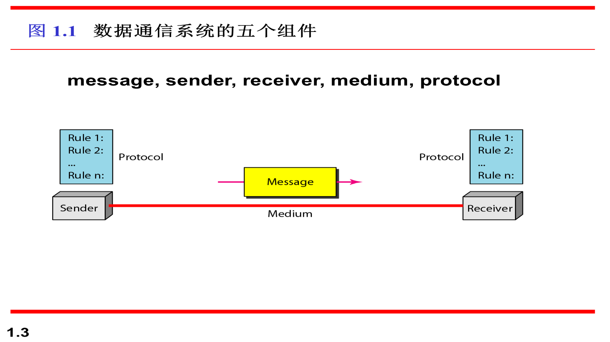
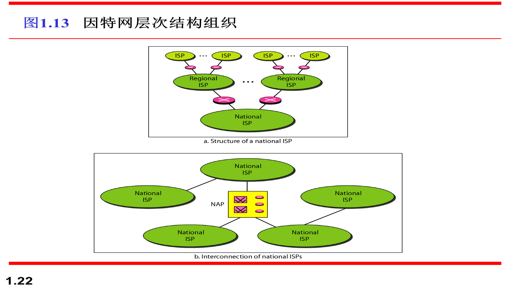
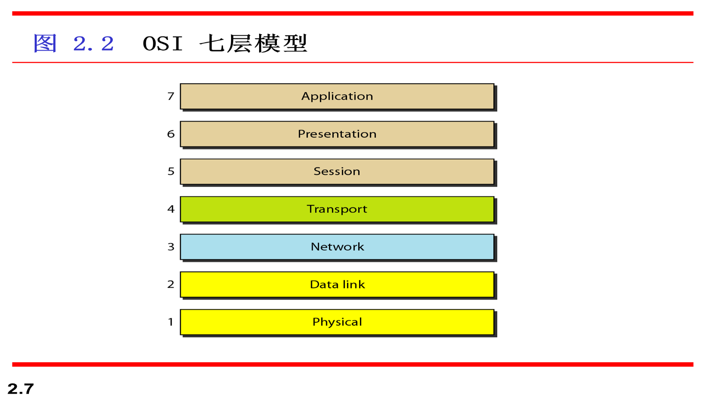
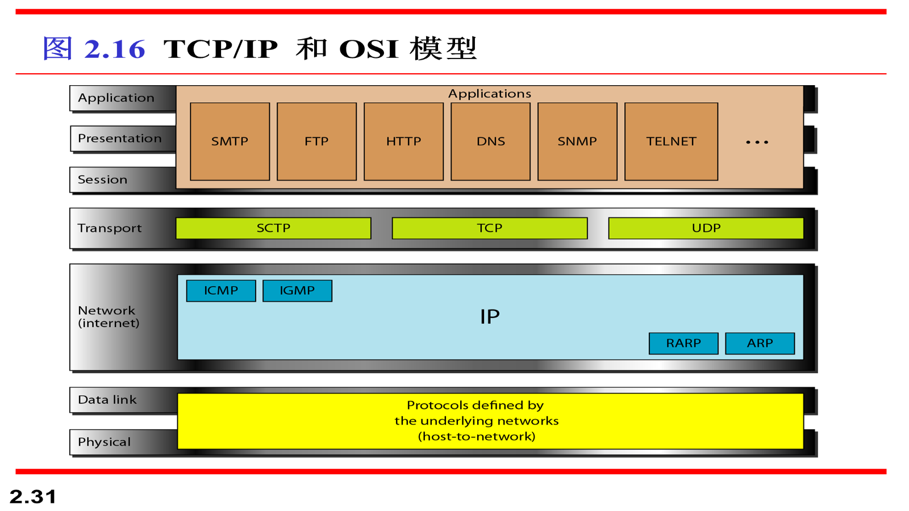
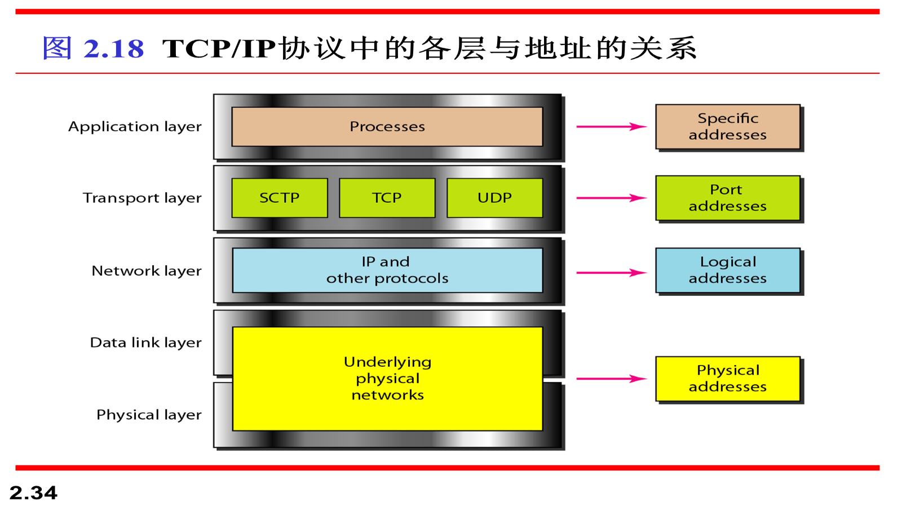
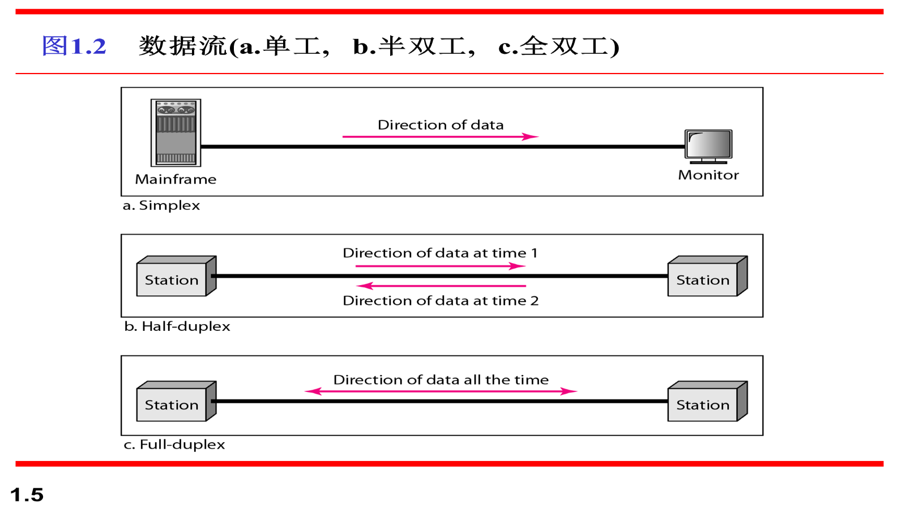
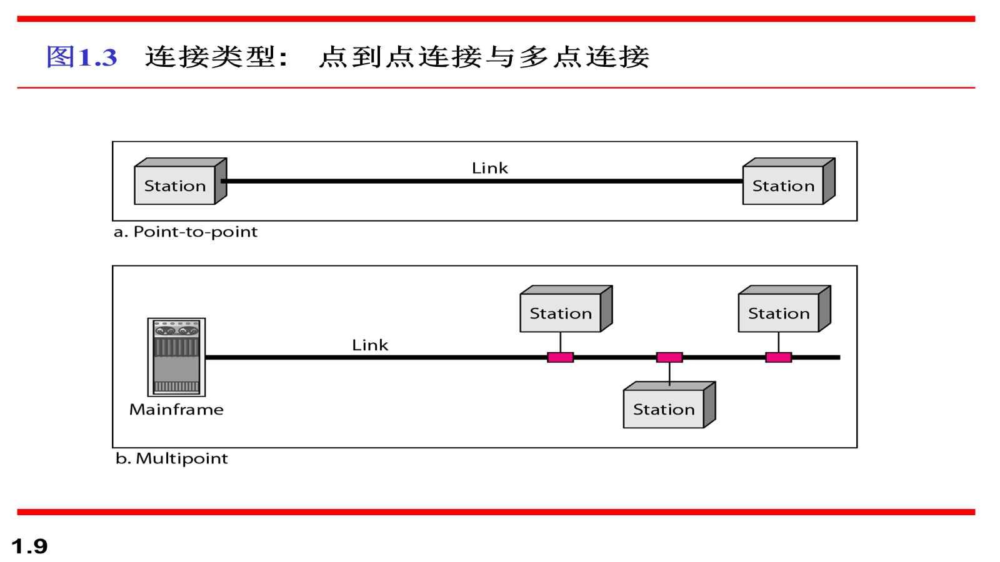
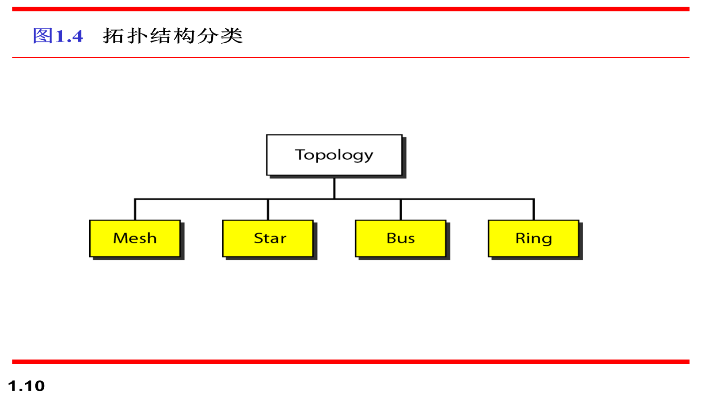

# 计算机网络原理详细知识点复习

## 标记说明

- `【重点】`：原课件中反复出现、公式化、总结化、明显需要重点记住的内容
- `【次重点】`：和核心考点关系紧密，常作为理解、比较、补充或延伸出现的内容
- `【一般】`：课件中出现但通常不是本章最核心的内容
- `核心简短记忆要点`：只给重点且内容较长、较难记的知识点补充，位置紧跟在对应知识点后面

## 一、绪论、网络与分层

### 【重点】 数据通信的定义
- 数据通信：两台设备之间通过某种传输介质进行数据交换。
- 数据通信系统五个组成部分：
  - `message`：消息
  - `sender`：发送方
  - `receiver`：接收方
  - `medium`：传输介质
  - `protocol`：协议



**核心简短记忆要点：**
- 【必背】数据通信 = 设备之间交换数据
- 【必背】五要素 = 消息、发送方、接收方、介质、协议

### 【重点】 网络的定义
- 网络：通过通信链路连接起来的一组设备或节点的集合。
- 节点可以是计算机、打印机、路由器等具有收发能力的设备。



### 【重点】 协议、标准、模型
- 协议：通信双方共同遵守的规则。
- 标准：经过协商形成并统一采用的规则。
- `ISO` 是国际标准化组织。
- `OSI` 是模型，不是协议。

### 【重点】 OSI 与 TCP/IP 的关系
- OSI 是理论上的分层参考模型。
- OSI 是七层模型，七层名称从下到上分别是：
  - 物理层
  - 数据链路层
  - 网络层
  - 传输层
  - 会话层
  - 表示层
  - 应用层
- TCP/IP 是实际使用的协议体系。
- TCP/IP 通常按 4 层或 5 层理解：
  - 4 层写法：主机到网络层、互联网层、传输层、应用层
  - 与 OSI 对照时也常写成 5 层：物理层、数据链路层、网络层、传输层、应用层
- 两者并不是严格一一对应：
  - TCP/IP 的应用层大致对应 OSI 的应用层、表示层、会话层
  - TCP/IP 的传输层大致对应 OSI 的传输层
  - TCP/IP 的互联网层或网络层大致对应 OSI 的网络层
  - 主机到网络层大致对应数据链路层和物理层





**核心简短记忆要点：**
- 【必背】OSI 是模型，TCP/IP 是实际协议体系
- 【必背】OSI 七层 = 物理 / 数据链路 / 网络 / 传输 / 会话 / 表示 / 应用
- 【必背】TCP/IP 四层 = 主机到网络 / 互联网 / 传输 / 应用
- 【必背】TCP/IP 五层 = 物理 / 数据链路 / 网络 / 传输 / 应用

### 【重点】 TCP/IP 中四类地址
- 物理地址：链路层地址，最典型是 MAC 地址
- 逻辑地址：网络层地址，最典型是 IP 地址
- 端口地址：传输层地址，用来定位主机中的进程
- 专用地址：特定应用内部使用的地址



**核心简短记忆要点：**
- 【必背】四类地址 = 物理地址、逻辑地址、端口地址、专用地址

### 【次重点】 分层的作用
- 降低设计复杂度
- 每层只关心本层功能
- 上层使用下层提供的服务
- 有利于标准化和模块替换

**核心简短记忆要点：**
- 【核心记忆】分层的目的就是“把复杂问题拆开，各层各管一摊”

### 【次重点】 常见网络评价指标
- 性能：吞吐量、时延
- 可靠性
- 安全性

### 【一般】 数据流方向
- 单工：只能单向发送
- 半双工：双向都能发，但不能同时
- 全双工：双向可同时发送



### 【一般】 连接类型
- 点到点连接：链路只连接两个设备
- 多点连接：多个设备共享一条链路



### 【一般】 拓扑结构
- 网状：可靠但成本高
- 星型：管理方便，但依赖中心节点
- 总线：结构简单，但冲突明显
- 环形：数据沿环传播
- 混合：多种拓扑组合



### 本章题目与参考答案

1. 题目：OSI 模型与 TCP/IP 协议簇有什么区别与联系？
   - 参考答案：OSI 是七层参考模型，TCP/IP 是实际使用的协议体系；TCP/IP 常写成四层，也可按与 OSI 对照写成五层；两者层次不是严格一一对应。
   - 易错点：不要把 OSI 当成真正广泛使用的协议体系。
2. 题目：为什么网络系统要分层？
   - 参考答案：降低复杂度、明确职责、便于标准化和模块替换。
   - 易错点：不要只写“为了方便设计”，要写出至少两个具体原因。

## 二、信号、带宽、数据率

### 【重点】 数据与信号的关系
- 数据可以是模拟的，也可以是数字的。
- 信号可以是模拟的，也可以是数字的。
- 数据要传输，最终都要变成电磁信号。

### 【重点】 奈奎斯特公式
无噪声信道最大比特率：

```text
比特率 = 2 × 带宽 × log2L
```

记忆点：
- 带宽越大，速率越高
- 电平数 `L` 越多，速率越高

**核心简短记忆要点：**
- 【必背】奈奎斯特管“无噪声上限”

### 【重点】 香农容量定理
有噪声信道的理论上限：

```text
通道容量 = 带宽 × log2(1 + SNR)
```

记忆点：
- 香农给的是上限
- 再增加电平数，也不可能突破这个上限

**核心简短记忆要点：**
- 【必背】香农管“有噪声上限”

### 【重点】 传播时间和传输时间
- 传播时间：

```text
传播时间 = 距离 / 传播速度
```

- 传输时间：

```text
传输时间 = 数据长度 / 带宽
```

易混点：
- 传播时间看“路有多长”
- 传输时间看“数据有多长、带宽有多宽”

**核心简短记忆要点：**
- 【必背】传播时间看距离，传输时间看数据量和带宽

### 【重点】 总时延组成
- 传播时延
- 传输时延
- 排队时延
- 处理时延

**核心简短记忆要点：**
- 【必背】总时延 = 传播 + 传输 + 排队 + 处理

### 【重点】 带宽延迟乘积
- 含义：一条链路上“能装下”的比特数
- 直观理解：带宽决定管道粗细，延迟决定管道长度

**核心简短记忆要点：**
- 【核心记忆】带宽延迟积 = 一条链路里最多能“装下”的 bit 数

### 【次重点】 比特率与电平数
- 若一个数字信号有 `L` 个电平，则每个信号元素大致能携带 `log2L` 位信息
- 但真实编码时，位数必须可实现，不能出现不合理的分数位表示

### 【次重点】 有限带宽下数字信号失真
- 理想方波需要无限多谐波
- 实际信道带宽有限，所以只能传近似波形

### 【一般】 dB 与损耗
- 常用于描述电缆或信道中的功率衰减
- 常见题型是给每公里损耗，求若干距离后的信号功率

### 本章题目与参考答案

1. 题目：奈奎斯特公式和香农公式分别描述什么？
   - 参考答案：前者是无噪声信道比特率上限，后者是有噪声信道容量上限。
   - 易错点：不要把两者适用条件写反。
2. 题目：传播时间和传输时间有什么区别？
   - 参考答案：传播时间看距离和速度，传输时间看数据长度和带宽。
   - 易错点：不要把“路上跑多久”和“装货多久”混在一起。

## 三、数字传输、模拟传输、多路复用

### 【重点】 调制方式
- ASK：幅移键控
- FSK：频移键控
- PSK：相移键控
- QPSK：一个信号元素可携带 2 bit
- QAM：同时改变幅度和相位

**核心简短记忆要点：**
- 【必背】ASK 改幅度，FSK 改频率，PSK 改相位，QAM 幅度相位一起改

### 【重点】 ASK 带宽
```text
B = (1 + d) × S
```

- `B`：带宽
- `S`：信号速率
- `d`：0 到 1 的修正因子

### 【重点】 QPSK 要点
- 可以看成两个相互正交的 BPSK
- 每个信号元素承载 2 bit

**核心简短记忆要点：**
- 【必背】QPSK 本质是两个正交 BPSK

### 【重点】 三种复用方式
- FDM：频分多路复用
- TDM：时分多路复用
- WDM：波分多路复用

**核心简短记忆要点：**
- 【核心记忆】多路复用的核心就是“多路信号共享一条链路”

### 【重点】 FDM、TDM、WDM 区别
- FDM：按频率划分，常用于模拟信号
- TDM：按时间片划分，常用于数字信号
- WDM：本质类似 FDM，但用于光信号

**核心简短记忆要点：**
- 【必背】FDM 按频率分，TDM 按时间分，WDM 按波长分

### 【次重点】 WDM 在光纤中的应用
- 光信号频率极高
- 适合按波长拆分和组合多个通道

### 【次重点】 调制的作用
- 把数字数据映射到适合信道传输的载波变化上

### 本章题目与参考答案

1. 题目：FDM、TDM、WDM 的区别是什么？
   - 参考答案：分别按频率、时间、波长来复用多路信号。
   - 易错点：WDM 不要写成完全独立于 FDM 的思想。
2. 题目：调制的本质是什么？
   - 参考答案：把信息映射到适合信道传输的载波变化上。
   - 易错点：不要只答“为了远距离传输”。

## 四、交换

### 【重点】 电路交换
- 先建立专用路径，再传输数据
- 特点：
  - 时延较稳定
  - 资源利用率较低

**核心简短记忆要点：**
- 【必背】电路交换 = 先建路再传
- 【核心记忆】比较交换方式，抓“资源利用率”和“时延稳定性”

### 【重点】 分组交换
- 把数据切成分组后再独立转发
- 特点：
  - 资源利用率较高
  - 可能出现排队和拥塞

**核心简短记忆要点：**
- 【必背】分组交换 = 切成分组再转发

### 【重点】 电路交换 vs 分组交换
- 电路交换：
  - 先建连接
  - 资源预留
  - 利用率低
- 分组交换：
  - 无需长期独占链路
  - 利用率高
  - 更灵活，但不保证固定时延

**核心简短记忆要点：**
- 【必背】电路交换稳但浪费，分组交换省但可能拥塞

### 【次重点】 电话网中的电路交换
- 传统语音业务要求稳定连续传输

### 本章题目与参考答案

1. 题目：电路交换和分组交换有什么区别？
   - 参考答案：比较建路方式、资源利用率、时延特性。
   - 易错点：不要只写一个“一个先建连接一个不建连接”。
2. 题目：为什么传统电话网典型使用电路交换？
   - 参考答案：语音业务强调稳定连续的传输。
   - 易错点：不要答成“因为技术落后”这种泛化表述。

## 五、差错控制与数据链路层

### 【重点】 数据链路层功能
- 成帧
- 流量控制
- 差错控制
- 介质访问控制

### 【重点】 成帧
- 作用：把连续比特流切分成可识别的帧
- 常见方式：
  - 固定长度
  - 可变长度
  - 面向字符
  - 面向比特

**核心简短记忆要点：**
- 【必背】链路层四件事 = 成帧、流控、差控、介质访问控制

### 【重点】 奇偶校验
- 简单奇偶校验码：
  - `n = k + 1`
  - `dmin = 2`
- 作用：
  - 能检出奇数个差错
  - 不能纠错

**核心简短记忆要点：**
- 【必背】奇偶校验能检错，不能纠错

### 【重点】 CRC
- CRC：循环冗余校验
- 核心思想：
  - 数据末尾补 0
  - 用生成多项式做模 2 除法
  - 余数作为校验位
- 记忆点：
  - 模 2 加减法本质类似异或

**核心简短记忆要点：**
- 【必背】CRC = 补零 + 模 2 除法 + 余数作校验位

### 【重点】 停等协议
- 发送方发送 1 帧后必须等待确认，再发送下一帧

### 【重点】 停等 ARQ
- 在停等协议基础上加入：
  - 超时重传
  - 差错检测
- 序号通常只需 0 和 1，按模 2 循环

**核心简短记忆要点：**
- 【必背】停等 ARQ = 发一帧等一帧

### 【重点】 Go-Back-N 与 Selective Repeat
- Go-Back-N：
  - 某帧出错时，从该帧开始往后重传
- Selective Repeat：
  - 只重传出错的帧

**核心简短记忆要点：**
- 【核心记忆】Go-Back-N 重传一串，Selective Repeat 只重传错的

### 【次重点】 序号的作用
- 防止帧重传时接收方混淆新旧帧

### 【次重点】 停等协议的效率特点
- 每次只能飞行一帧，链路利用率低

### 本章题目与参考答案

1. 题目：CRC 的基本思想是什么？
   - 参考答案：补零、模 2 除法、余数作校验位。
   - 易错点：不要漏掉“接收方再做同样除法验证”。
2. 题目：Go-Back-N 与 Selective Repeat 的区别是什么？
   - 参考答案：一个重传一串，一个只重传出错帧。
   - 易错点：不要只写“它们都是 ARQ”。

## 六、多路访问、ALOHA、CSMA

### 【重点】 纯 ALOHA
- 脆弱时间：

```text
2 × 一帧发送时间
```

- 吞吐量：

```text
S = G × e^(-2G)
```

- 最大吞吐量：

```text
Smax = 0.184
```

在 `G = 0.5` 时达到最大。

### 【重点】 时隙 ALOHA
- 脆弱时间：

```text
1 × 一帧发送时间
```

- 吞吐量：

```text
S = G × e^(-G)
```

- 最大吞吐量：

```text
Smax = 0.368
```

在 `G = 1` 时达到最大。

**核心简短记忆要点：**
- 【必背】纯 ALOHA 脆弱时间 2T，时隙 ALOHA 脆弱时间 1T
- 【必背】纯 ALOHA 最大吞吐量 0.184，时隙 ALOHA 最大吞吐量 0.368
- 【核心记忆】时隙 ALOHA 比纯 ALOHA 强，因为冲突窗口更短

### 【重点】 纯 ALOHA 与时隙 ALOHA 比较
- 纯 ALOHA：
  - 任意时刻可发
  - 冲突窗口更长
  - 吞吐量更低
- 时隙 ALOHA：
  - 只能在时隙起点发送
  - 冲突窗口更短
  - 吞吐量更高

### 【重点】 CSMA/CD
- 先监听，再发送，冲突后检测并停止
- 最小帧长条件：

```text
L = R × 2Tp
```

- 标准 10Mbps 以太网：
  - 冲突时槽 `51.2 us`
  - 最小帧长 `512 bit = 64 Byte`

**核心简短记忆要点：**
- 【必背】CSMA/CD 适合有线，以太网常用

### 【重点】 CSMA/CA
- 无线中难以检测冲突，所以采用冲突避免
- 核心机制：
  - 帧间间隔
  - 竞争窗口
  - 确认帧
- RTS/CTS 可缓解隐藏站问题

**核心简短记忆要点：**
- 【必背】CSMA/CA 适合无线

### 【次重点】 无线网络中的 CSMA/CA
- 无线信号能量衰减大，冲突信号不容易被可靠检测

### 本章题目与参考答案

1. 题目：为什么时隙 ALOHA 比纯 ALOHA 吞吐量高？
   - 参考答案：时隙化后脆弱时间缩短，冲突窗口更小。
   - 易错点：不要只背最大吞吐量数值而不解释原因。
2. 题目：为什么无线网络更适合 CSMA/CA？
   - 参考答案：无线环境中冲突难可靠检测，因此更适合冲突避免。
   - 易错点：不要把 CSMA/CD 和 CSMA/CA 的应用场景写反。

## 七、以太网、无线局域网、交换机、VLAN

### 【重点】 以太网
- 标准以太网使用 `1-持续 CSMA/CD`
- 常见实现：
  - 10Base5：粗缆
  - 10Base2：细缆
  - 10Base-T：双绞线
  - 10Base-F：光纤

**核心简短记忆要点：**
- 【必背】以太网默认配套 1-持续 CSMA/CD

### 【重点】 10Base-T 特点
- 物理星型
- 逻辑总线
- 双绞线长度通常不超过 100m

**核心简短记忆要点：**
- 【必背】10Base-T = 物理星型，逻辑总线

### 【重点】 无线局域网
- IEEE 802.11
- DCF：基于 CSMA/CA
- PCF：基于轮询

**核心简短记忆要点：**
- 【必背】802.11 中 DCF 用 CSMA/CA，PCF 用轮询

### 【重点】 二层交换机
- 本质：高性能多端口网桥
- 按 MAC 地址做转发决策

### 【重点】 VLAN
- VLAN：虚拟局域网
- 作用：把一个物理局域网切分成多个广播域

**核心简短记忆要点：**
- 【必背】VLAN 的本质 = 划分广播域
- 【核心记忆】VLAN 不是新物理网，而是逻辑分组

### 【重点】 广播域
- 广播帧能到达的范围
- 多播帧和未知单播帧也会在同一广播域中传播

### 【次重点】 VLAN 的作用
- 减少广播带来的性能影响
- 提高管理灵活性
- 增强逻辑隔离

### 本章题目与参考答案

1. 题目：VLAN 的作用是什么？
   - 参考答案：划分广播域、提高管理灵活性、减少广播影响。
   - 易错点：不要把 VLAN 说成“新的物理网络”。
2. 题目：10Base-T 的特点是什么？
   - 参考答案：物理星型、逻辑总线、双绞线长度通常不超过 100m。
   - 易错点：物理结构和逻辑结构不要写反。

## 八、IPv4 与地址划分

### 【重点】 IPv4 地址
- 长度：`32 bit`
- 特点：
  - 唯一
  - 通用

**核心简短记忆要点：**
- 【必背】IPv4 = 32 bit

### 【重点】 IPv4 地址空间
```text
2^32
```

### 【重点】 分类寻址
- A、B、C、D、E 类
- 默认掩码：
  - A 类：`/8`
  - B 类：`/16`
  - C 类：`/24`

**核心简短记忆要点：**
- 【必背】A/B/C 类默认掩码 = /8、/16、/24

### 【重点】 无类寻址
- 表示法：

```text
x.y.z.t /n
```

- `/n` 是前缀长度，也就是掩码中 1 的个数

**核心简短记忆要点：**
- 【必背】无类寻址写法 = x.y.z.t/n
- 【核心记忆】无类寻址就是“前缀固定，主机位自由变”

### 【重点】 地址块计算
- 起始地址：
  - 主机位全 0
  - 或 `地址 AND 掩码`
- 最后地址：
  - 主机位全 1
  - 或 `地址 OR 反掩码`
- 地址个数：

```text
2^(32-n)
```

**核心简短记忆要点：**
- 【必背】地址个数 = 2^(32-n)

**核心简短记忆要点：**
- 【必背】起始地址全 0，最后地址全 1

### 【重点】 网络地址与主机地址
- 网络地址一般不分配给主机
- 广播地址也不能分配给普通主机

### 【次重点】 无类寻址取代分类寻址
- 分类寻址浪费地址严重
- 无类寻址更灵活，更利于地址块划分

### 【次重点】 NAT
- NAT：网络地址转换
- 核心作用：把内部地址转换成对外可用的地址

### 本章题目与参考答案

1. 题目：无类寻址中，如何求起始地址、最后地址和地址个数？
   - 参考答案：起始地址主机位全 0，最后地址主机位全 1，地址个数是 `2^(32-n)`。
   - 易错点：不要把网络地址和主机地址的位数搞错。
2. 题目：为什么分类寻址被无类寻址取代？
   - 参考答案：分类寻址浪费地址严重，无类寻址更灵活。
   - 易错点：不要只写“因为地址不够用”，要强调灵活性。

## 九、IPv4 数据报与分片

### 【重点】 IPv4 的定位
- IPv4 是 TCP/IP 协议族的网络层核心协议

### 【重点】 头部长度字段
- 单位：`4 字节`
- 若 HLEN = 5：

```text
头部长度 = 5 × 4 = 20 字节
```

### 【重点】 总长度字段
- 含义：数据报总长度 = 头部 + 数据

**核心简短记忆要点：**
- 【必背】总长度 = 头部 + 数据

### 【重点】 数据长度计算
```text
数据长度 = 总长度 - 头部长度
```

### 【重点】 TTL
- 生存时间，限制数据报能经过的最大跳数

### 【重点】 协议字段
- 标识上层封装的协议类型

### 【重点】 分片关键字段
- `M` 位：是否还有后续分片
- `offset`：分片偏移，单位是 8 字节

### 【重点】 分片判断规则
- `M = 0`：
  - 是最后一个分片，或者根本没分片
- `M = 1`：
  - 不是最后一个分片
- `M = 1` 且 `offset = 0`：
  - 第一个分片

**核心简短记忆要点：**
- 【必背】M = 0 不一定没分片，只能说明“后面没有更多分片”

### 【重点】 分片首字节编号
```text
首字节编号 = offset × 8
```

**核心简短记忆要点：**
- 【必背】头部长度字段单位是 4 字节
- 【必背】offset 的单位是 8 字节
- 【核心记忆】分片首字节编号 = offset × 8

### 【次重点】 分片判断中 M 位与 offset 的关系
- 因为 `M = 1` 时既可能是第一个，也可能是中间分片，还要结合 `offset`

### 本章题目与参考答案

1. 题目：IPv4 数据报中头部长度字段和总长度字段分别表示什么？
   - 参考答案：头部长度按 4 字节计，总长度是头部加数据的总长度。
   - 易错点：不要把头部长度字段当成字节数直接写。
2. 题目：如何根据 `M` 位和 `offset` 判断分片位置？
   - 参考答案：`M=0` 表示后面无更多分片；`M=1且offset=0` 是第一个分片。
   - 易错点：不要只看 `M` 位就判断是不是首分片。

## 十、ARP、ICMP、转发与路由

### 【重点】 ARP
- 作用：把逻辑地址映射成物理地址

**核心简短记忆要点：**
- 【必背】ARP = 逻辑地址找物理地址
- 【必背】ARP 请求广播，ARP 应答单播

### 【重点】 ARP 报文方向
- ARP 请求：广播
- ARP 应答：单播

### 【重点】 代理 ARP
- 由代理设备代替目标主机回答 ARP 请求

### 【重点】 ICMP
- 作用：
  - 差错报告
  - 查询
- 设计原因：
  - IP 自身没有完善的差错报告和查询机制

**核心简短记忆要点：**
- 【必背】ICMP 负责差错报告和查询

### 【重点】 ICMP 报错对象
- ICMP 总是向原始源主机报告差错

### 【重点】 最长掩码匹配
- 路由查找原则：选择前缀最长、掩码最精确的匹配项

**核心简短记忆要点：**
- 【必背】最长掩码匹配 = 前缀越长越优先

### 【重点】 默认路由
- 当没有任何路由项匹配时，走默认路由
- 可以等价写成：

```text
0.0.0.0/0
```

**核心简短记忆要点：**
- 【必背】默认路由 = 0.0.0.0/0

### 【重点】 路由协议分类
- IGP：自治系统内部
  - RIP
  - OSPF
- EGP：自治系统之间
  - BGP

**核心简短记忆要点：**
- 【核心记忆】RIP 是距离向量，OSPF 是链路状态，BGP 是路径向量

### 【重点】 三类典型路由协议
- RIP：距离向量，Bellman-Ford
- OSPF：链路状态，Dijkstra
- BGP：路径向量

### 【次重点】 路由协议与被路由协议的区别
- 路由协议：负责学习最佳路径、维护路由表
- 被路由协议：真正承载用户数据并被转发的网络层协议，如 IP

### 【次重点】 有类路由协议与无类路由协议
- 有类：更新时不带子网掩码
- 无类：更新时带子网掩码

### 本章题目与参考答案

1. 题目：ARP 为什么请求广播、应答单播？
   - 参考答案：请求时不知道目标 MAC，只能广播；目标主机知道请求方后可单播回复。
   - 易错点：不要把 ARP 的逻辑地址和物理地址作用写反。
2. 题目：什么是最长掩码匹配？
   - 参考答案：路由查找时选择前缀最长、掩码最精确的匹配项。
   - 易错点：不要把默认路由和最长掩码匹配的优先关系写反。

## 十一、传输层：UDP、TCP、SCTP

### 【重点】 传输层任务
- 实现进程到进程的通信
- 实现复用与分离

**核心简短记忆要点：**
- 【必背】传输层管“进程到进程”

### 【重点】 UDP
- UDP：无连接、不可靠
- 特点：
  - 只在 IP 基础上增加最少量的进程通信支持
  - 有端口、长度、校验和

**核心简短记忆要点：**
- 【必背】UDP = 无连接、不可靠、快

### 【重点】 TCP
- TCP：面向连接
- 提供：
  - 可靠传输
  - 流量控制
  - 差错控制

**核心简短记忆要点：**
- 【核心记忆】TCP 通过三次握手建立连接

### 【重点】 TCP 序号
- 一个段的序号字段值表示该段中“第一个字节”的编号

**核心简短记忆要点：**
- 【必背】TCP 序号看“第一个字节”，确认号看“下一个期望字节”

### 【重点】 TCP 确认号
- 表示期望收到的下一个字节编号
- TCP 确认是累积确认

### 【重点】 三次握手
- 用于建立连接
- 至少要能说清：
  - 双方需要建立可靠连接
  - 课件强调其用于建立连接

### 【重点】 TCP 滑动窗口
- 作用：
  - 提高传输效率
  - 实现流量控制
- 关键点：
  - TCP 的窗口是按字节而不是按帧计算

### 【重点】 发送窗口大小
- 受两个因素限制：
  - `rwnd`：接收窗口
  - `cwnd`：拥塞窗口
- 实际可发送窗口取二者较小值

### 【次重点】 UDP 和 TCP 的区别
- UDP：
  - 无连接
  - 不保证可靠
  - 简单，时延小
- TCP：
  - 面向连接
  - 可靠
  - 机制复杂但更稳定

**核心简短记忆要点：**
- 【必背】TCP = 面向连接、可靠、复杂

### 【次重点】 UDP 适用场景
- 对时延敏感
- 能容忍一定丢包
- 不需要复杂连接管理

### 本章题目与参考答案

1. 题目：UDP 和 TCP 的主要区别是什么？
   - 参考答案：一个无连接不可靠，一个面向连接可靠；同时比较复杂度和适用场景。
   - 易错点：不要只写“TCP 更好”，要写清使用代价。
2. 题目：TCP 为什么要三次握手？
   - 参考答案：课件明确用于建立连接，答题时要围绕可靠建立连接来写。
   - 易错点：不要展开到课件没明确讲的细节推导。

## 十二、拥塞控制与 QoS

### 【重点】 拥塞
- 当网络中输入的分组数量超过网络处理能力时，就会发生拥塞

**核心简短记忆要点：**
- 【必背】拥塞 = 网络整体太忙

### 【重点】 拥塞控制分类
- 开环拥塞控制：预防
- 闭环拥塞控制：检测后再消除

**核心简短记忆要点：**
- 【必背】开环拥塞控制偏预防，闭环偏事后调节

### 【重点】 TCP 拥塞控制中的指数增加阶段
- 拥塞窗口按指数规律增长
- 直到达到阈值

**核心简短记忆要点：**
- 【必背】指数增加阶段增长快，拥塞避免阶段按加性增加增长

### 【重点】 TCP 拥塞避免
- 拥塞窗口按加性增加增长

### 【重点】 拥塞发生后的反应
- 超时：
  - 回到新的指数增加阶段
- 三个重复 ACK：
  - 进入新的拥塞避免阶段

**核心简短记忆要点：**
- 【必背】超时后回到指数增加阶段，三个重复 ACK 后进入拥塞避免

### 【重点】 QoS
- QoS：服务质量
- 含义：为数据流提供某种性能目标或服务保证

### 【重点】 改进 QoS 的四类技术
- 调度
- 通信量整形
- 许可控制
- 资源预留

**核心简短记忆要点：**
- 【必背】QoS 常见手段 = 调度、整形、许可控制、资源预留

### 【重点】 漏桶算法
- 作用：把突发流量整形成较平滑的固定速率流量
- 桶满时可能丢包

### 【次重点】 拥塞控制和流量控制的区别
- 流量控制：防止接收方来不及接收
- 拥塞控制：防止整个网络超载

**核心简短记忆要点：**
- 【核心记忆】流量控制管接收方，拥塞控制管整个网络

### 本章题目与参考答案

1. 题目：拥塞控制和流量控制有什么区别？
   - 参考答案：流量控制防止接收方来不及接收，拥塞控制防止网络整体超载。
   - 易错点：不要把两者都写成“防丢包”。
2. 题目：改进 QoS 的常见技术有哪些？
   - 参考答案：调度、通信量整形、许可控制、资源预留。
   - 易错点：不要漏掉任意一项。

## 十三、综合题与参考答案

### 可能综合问到的内容

1. 为什么网络系统要分层？OSI 与 TCP/IP 有什么区别和联系？
2. 奈奎斯特公式和香农公式分别描述什么？为什么它们不能混用？
3. 传播时间、传输时间、带宽延迟积三者之间有什么联系和区别？
4. 为什么时隙 ALOHA 吞吐量高于纯 ALOHA？
5. 为什么无线网络更适合 CSMA/CA 而不是 CSMA/CD？
6. ARP、ICMP、路由、转发分别解决什么问题？
7. TCP 为什么要建立连接？拥塞控制和流量控制为什么不是一回事？

### 回答主线

- 这些题都是跨章节串联题，适合放在全文最后统一复习。
- 答题顺序建议：
  - 先下定义
  - 再写原理
  - 再给区别
  - 最后写结果或意义

## 十四、易混点对比

| 易混点 | 核心区别 | 最短记忆法 |
|---|---|---|
| OSI / TCP-IP | 一个是模型，一个是实际协议体系 | 模型 vs 体系 |
| 单工 / 半双工 / 全双工 | 单向、双向不能同时、双向可同时 | 单-半-全 |
| 传播时间 / 传输时间 | 一个看距离，一个看数据量和带宽 | 路上时间 vs 装载时间 |
| 电路交换 / 分组交换 | 先建路 vs 先切分组 | 独占资源 vs 动态共享 |
| 纯 ALOHA / 时隙 ALOHA | 冲突窗口不同 | 2T vs 1T |
| CSMA/CD / CSMA/CA | 有线冲突检测 vs 无线冲突避免 | 检测 vs 避免 |
| 物理地址 / 逻辑地址 / 端口地址 | 设备、网络、进程三级定位 | MAC / IP / Port |
| UDP / TCP | 无连接不可靠 vs 面向连接可靠 | 快但简单 / 稳但复杂 |

## 十五、复习节奏建议

### 建议顺序

1. 第一轮：完整看一遍知识点
2. 第二轮：每章只看 `核心简短记忆要点 + 本章题目与参考答案`
3. 第三轮：只看 `易混点对比 + 综合题`
4. 考前最后：只扫
   - 公式
   - 比较点
   - 路由/分片/握手/拥塞控制这些流程
