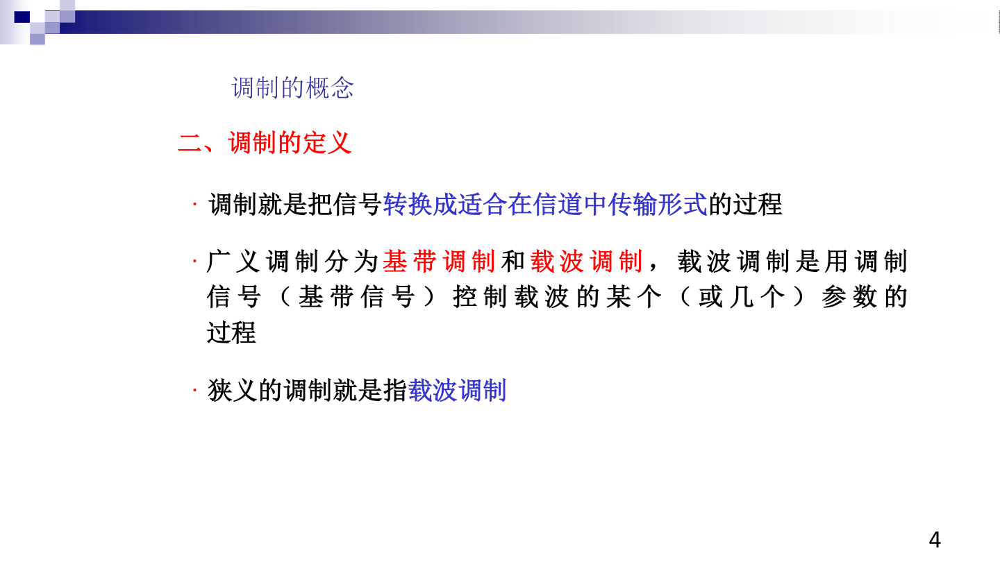
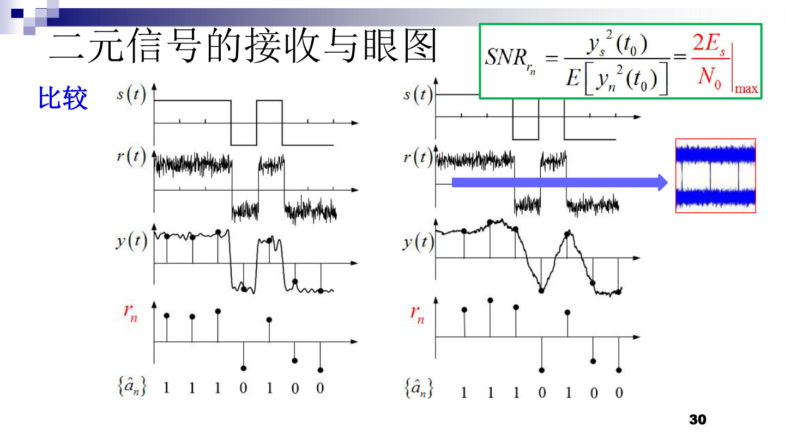
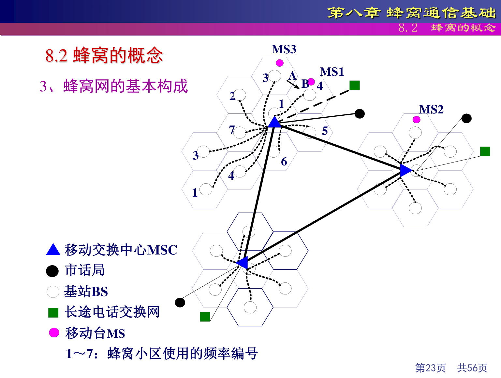
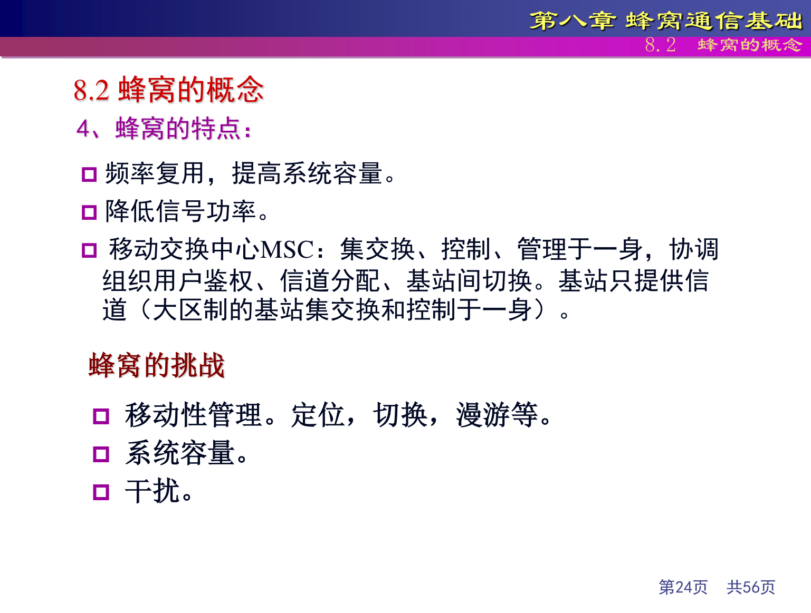
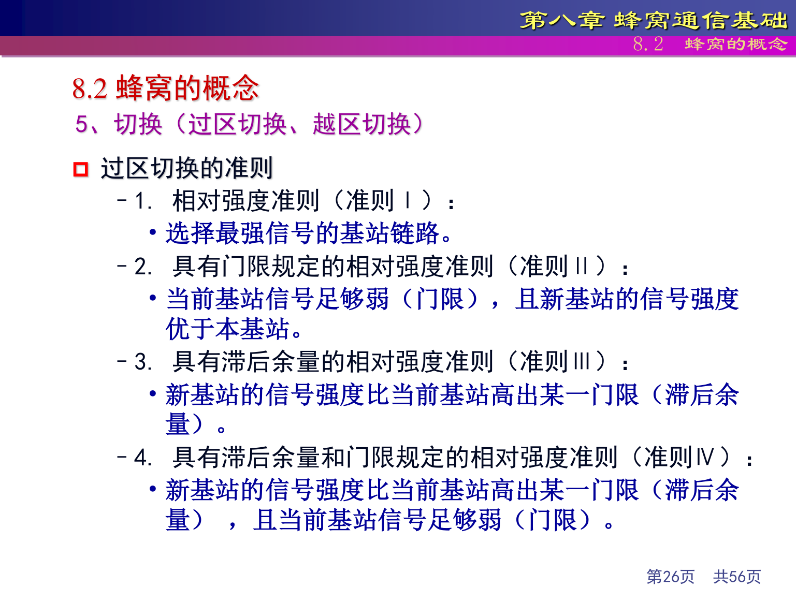

# 通信原理详细知识点复习

## 标记说明

- `【重点】`：原课件中反复出现、公式化、总结化、明显需要重点记住的内容
- `【次重点】`：和核心考点关系紧密，常作为理解、比较、补充或延伸出现的内容
- `【一般】`：课件中出现但通常不是本章最核心的内容
- `核心简短记忆要点`：只给重点且内容较长、较难记的知识点补充，位置紧跟在对应知识点后面

## 一、绪论与通信基础

### 【重点】 消息、信息、信号
- 消息：通信系统要传输的对象，如语音、图像、数据、文字。
- 信息：消息中蕴含的有效内容，是能减少不确定性的部分。
- 信号：消息的物理载体，是消息的电表示形式或传输载体。

**核心简短记忆要点：**
- 【必背】消息是对象，信息是内容，信号是载体

### 【重点】 通信系统一般模型
基本结构：

```text
信源 -> 发送设备 -> 信道 -> 接收设备 -> 信宿
```

若是带通信号传输，可进一步写成：

```text
基带信号 -> 调制器 -> 已调信号 -> 信道 -> 解调器 -> 恢复基带
```

**核心简短记忆要点：**
- 【必背】系统模型 = 信源 -> 发送设备 -> 信道 -> 接收设备 -> 信宿

### 【重点】 基带信号与频带信号
- 基带信号：频谱位于零频附近的信号。
- 频带信号：频谱位于某个高频载波附近的信号。
- 基带传输：保持基带形式直接传送消息信号。
- 频带传输：把基带消息变成频带信号再传输。

**核心简短记忆要点：**
- 【必背】基带在零频附近，频带在载频附近
- 【核心记忆】调制就是把不适合传的基带信号变成适合信道传输的信号

### 【重点】 数字通信优于模拟通信的原因
- 抗干扰能力更强
- 便于再生中继
- 差错更容易控制
- 便于编码、压缩、存储、加密和复用

**核心简短记忆要点：**
- 【必背】数字通信强在抗干扰、可再生、便于编码

### 【重点】 信息量与熵
单个消息的信息量：

```text
I(x) = -log2 P(x)
```

离散信源熵：

```text
H(X) = -Σ p(xi) log2 p(xi)
```

### 【次重点】 调制的作用
- 基带信号很多时候不适合直接传输
- 调制后可以：
  - 适应信道频带
  - 提高传输距离
  - 便于天线辐射
  - 便于频分复用

### 【次重点】 信道中的四类典型问题
- 衰减：信号逐渐变弱
- 噪声：最典型是加性白高斯噪声 AWGN
- 干扰：同频、邻频、串扰等
- 畸变：信道频率特性不理想导致波形失真

### 【一般】 通信发展趋势
- 数字化
- 智能化
- 高速化
- 宽带化
- 移动化

### 本章题目与参考答案

1. 题目：什么是消息、信息、信号？三者有什么关系？
   - 参考答案：消息是传输对象，信息是有效内容，信号是物理载体。
   - 易错点：不要把“信息”和“信号”混成同一个概念。
2. 题目：为什么需要调制？
   - 参考答案：适应信道频带、便于辐射、便于复用、利于传输。
   - 易错点：不要只写“为了传输”，要把具体原因列出来。

## 二、模拟调制

### 【重点】 调制的分类
- 课件明确写出：调制可按载波类型、调制信号、载波参数变化等进行分类。
- 本章涉及的模拟连续波调制主要分为：
  - 幅度调制
  - 角度调制
- 幅度调制常见体制：
  - AM
  - DSB-SC
  - SSB
  - VSB
- 角度调制常见体制：
  - FM
  - PM



**核心简短记忆要点：**
- 【必背】模拟连续波调制两大类 = 幅度调制 + 角度调制
- 【必背】幅度调制 = AM / DSB-SC / SSB / VSB；角度调制 = FM / PM

### 【重点】 常规调幅 AM
表达式：

```text
sAM(t) = Ac [1 + ka m(t)] cos(2πfct)
```

调幅指数：

```text
μ = ka mp
```

带宽：

```text
BAM = 2W
```

调幅效率：

```text
η = μ² / (2 + μ²)
```

当 `μ = 1` 时效率最大，为 `1/3`。

- 课件还强调：
  - 常规调幅中，消息会体现在载波包络上
  - 接收时可采用包络检波

### 【重点】 DSB-SC
表达式：

```text
sDSB(t) = Ac m(t) cos(2πfct)
```

特点：
- 不传载波
- 带宽仍为 `2W`
- 调制效率高于常规 AM
- 一般需要相干解调

**核心简短记忆要点：**
- 【必背】AM 传载波，DSB-SC 不传载波
- 【核心记忆】比较调制方式时，抓“带宽、调制效率、解调复杂度”

### 【重点】 SSB
特点：
- 只传一个边带
- 带宽：

```text
BSSB = W
```

- 更节省带宽，但实现复杂

### 【重点】 VSB
- 只保留一个完整边带，另一边带保留一小部分
- 带宽介于 `W` 和 `2W` 之间
- 是效率与实现复杂度的折中

### 【重点】 角度调制
统一形式：

```text
s(t) = Ac cos[ωct + φ(t)]
```

- 角度调制包括：
  - FM
  - PM

### 【重点】 FM
- 瞬时频率：

```text
fi(t) = fc + kf m(t)
```

- 最大频偏：

```text
Δf = kf mp
```

- Carson 公式：

```text
BFM ≈ 2(Δf + W)
```

**核心简短记忆要点：**
- 【必背】Carson 公式：BFM ≈ 2(Δf + W)

### 【重点】 PM
- 相位项直接受消息控制
- 与 FM 的核心区别在于：
  - PM 控制相位偏移
  - FM 控制频率偏移

### 【次重点】 AM、DSB-SC、SSB、VSB 的比较
- AM：
  - 带宽 `2W`
  - 调制效率低
  - 可包络检波
- DSB-SC：
  - 带宽 `2W`
  - 调制效率高
  - 需相干解调
- SSB：
  - 带宽 `W`
  - 最节省带宽
  - 实现较复杂
- VSB：
  - 带宽和实现难度介于 AM 与 SSB 之间

**核心简短记忆要点：**
- 【必背】SSB 最省带宽，VSB 是折中
- 【必背】AM 带宽 2W，SSB 带宽 W

### 【次重点】 FM 与 PM 的关系
- 两者都是恒幅波
- 抗非线性失真能力强
- 波形相互关联，但调制本质不同

### 【一般】 宽带 FM 与窄带 FM
- 宽带 FM 占用频带更宽，但抗干扰能力更强，音质更好

### 本章题目与参考答案

1. 题目：比较 AM、DSB-SC、SSB、VSB 的差别。
   - 参考答案：从是否传载波、带宽、调制效率、解调方式四个维度比较。
   - 易错点：不要把 DSB-SC 和 SSB 的带宽写错。
2. 题目：FM 和 PM 的本质区别是什么？
   - 参考答案：FM 控制瞬时频率，PM 控制瞬时相位。
   - 易错点：不要把最大频偏和相位偏移混为一谈。

## 三、无线信道与多径传播

### 【重点】 四种传播方式
- 直射
- 反射
- 绕射
- 散射

**核心简短记忆要点：**
- 【必背】四种传播 = 直射、反射、绕射、散射

### 【重点】 多径传播的结果
- 同一信号通过多条路径到达接收端
- 会引起：
  - 衰落
  - 时延扩展
  - 频率选择性失真

### 【重点】 多普勒频移
- 相对运动会导致频率偏移
- 会影响接收信号的时变特性

### 【次重点】 路径损耗、阴影衰落、小尺度衰落
- 路径损耗：平均功率随距离衰减
- 阴影衰落：大型障碍物遮挡导致的慢变化衰落
- 小尺度衰落：多径叠加导致的快速波动

### 【次重点】 多径时延扩展的影响
- 不同路径到达时间不同
- 可能导致码间串扰 ISI

**核心简短记忆要点：**
- 【核心记忆】多径时延扩展严重时，更容易出现频率选择性失真和码间串扰

### 【一般】 无线信道的复杂性
- 因为它同时受到多径、移动性、遮挡和干扰影响

### 本章题目与参考答案

1. 题目：多径传播会导致什么后果？
   - 参考答案：会引起衰落、时延扩展、频率选择性失真。
   - 易错点：不要只写“信号变弱”，那只是路径损耗的一部分。
2. 题目：什么是路径损耗、阴影衰落、小尺度衰落？
   - 参考答案：路径损耗是平均衰减，阴影衰落是慢变化遮挡，小尺度衰落是快速波动。
   - 易错点：不要把阴影衰落和小尺度衰落混为一类。

## 四、数字基带传输

### 【重点】 PAM 基本思想
- 用脉冲幅度承载离散符号信息

**核心简短记忆要点：**
- 【必背】PAM 用脉冲幅度表示符号

### 【重点】 比特率、码元速率、带宽
- 比特率：每秒传输的比特数
- 码元速率：每秒传输的码元数
- 二者关系与每码元携带的比特数有关

```text
Rb = Rs × log2M
Rs = 1 / Ts
```

**核心简短记忆要点：**
- 【必背】Rb 看 bit，Rs 看码元

### 【重点】 无码间串扰 Nyquist 条件
- 核心目标：在抽样时刻，其他码元对当前码元无干扰

**核心简短记忆要点：**
- 【必背】Nyquist 条件就是“抽样时刻别的码元别来捣乱”

### 【重点】 升余弦滤波器
- 常用于满足无码间串扰并控制带宽
- 滚降系数 `α` 决定频谱扩展程度

### 【重点】 匹配滤波器
- 在 AWGN 条件下能使抽样时刻信噪比最大

**核心简短记忆要点：**
- 【必背】匹配滤波器在 AWGN 下最优

### 【重点】 眼图
- 眼图开口大小可用来判断：
  - 噪声影响
  - 定时偏差
  - 码间串扰程度



**核心简短记忆要点：**
- 【核心记忆】眼图睁得越开，系统越好判决

### 【次重点】 码间串扰的成因
- 因为带宽受限，脉冲展宽并相互重叠

### 【次重点】 升余弦滤波器的作用
- 因为它在控制带宽和消除 ISI 之间取得了工程折中

### 【次重点】 匹配滤波器的最优性
- 因为它在高斯白噪声条件下最大化判决时刻信噪比

### 本章题目与参考答案

1. 题目：什么是无码间串扰 Nyquist 条件？
   - 参考答案：抽样时刻当前码元保留，其他码元干扰为零。
   - 易错点：不要只写公式，要说明它想解决什么问题。
2. 题目：为什么匹配滤波器被称为最优？
   - 参考答案：在 AWGN 条件下使判决时刻信噪比最大。
   - 易错点：不要把“最优”理解成任何信道条件下都最优。

## 五、数字带通传输

### 【重点】 2ASK
- 用载波幅度变化表示符号
- 抗噪声能力相对较弱

**核心简短记忆要点：**
- 【必背】2ASK 改幅度，2FSK 改频率，2PSK 改相位

### 【重点】 2FSK
- 用不同频率表示不同符号

### 【重点】 2PSK
- 用相位变化表示符号
- 抗噪声性能优于 ASK

### 【重点】 2DPSK
- 利用相邻码元的相位差传信息
- 避免严格载波同步的困难

**核心简短记忆要点：**
- 【必背】2DPSK 传相位差，不传绝对相位
- 【核心记忆】同条件下 BPSK / QPSK / MSK 误码性能通常优于 2DPSK

### 【重点】 M 进制调制
- 每个码元可携带更多比特
- 频带利用率提高，但系统复杂度和误码风险通常也会上升

### 【重点】 QPSK
- 每个码元携带 2 bit
- 频谱效率高于二进制调制

**核心简短记忆要点：**
- 【必背】QPSK 每码元 2 bit

### 【重点】 QAM
- 同时利用幅度和相位变化
- 是高频带利用率调制的重要代表

**核心简短记忆要点：**
- 【必背】QAM 频带利用率高，但更吃信噪比

### 【次重点】 QAM 的频带利用率
- 因为在同样带宽内，一个码元可携带更多 bit 信息

### 【次重点】 QPSK、OQPSK、QDPSK 的关系
- 都是相位调制家族
- 主要差异在于相位跳变方式和同步/实现特性

### 本章题目与参考答案

1. 题目：2ASK、2FSK、2PSK、2DPSK 如何比较？
   - 参考答案：比较键控参数、同步要求、抗噪声能力、实现复杂度。
   - 易错点：不要漏掉 2DPSK 传相位差这个特征。
2. 题目：为什么 QAM 的频带利用率高？
   - 参考答案：同样带宽内每个码元可携带更多 bit 信息。
   - 易错点：不要直接写“QAM 更好”，要说清代价是更依赖信噪比。

## 六、信源编码

### 【重点】 信源编码总览
- 课件明确把模拟信号数字化的三个环节写为：
  - 抽样
  - 量化
  - 编码
- 课件还列出常见波形编码方法：
  - PCM
  - DPCM
  - ADPCM
- 还提到增量调制：
  - ΔM

**核心简短记忆要点：**
- 【必背】模拟信号数字化三环节 = 抽样 + 量化 + 编码
- 【必背】常见波形编码 = PCM / DPCM / ADPCM

### 【重点】 低通抽样定理
- 若信号最高频率为 `W`，则采样频率应满足：

```text
fs ≥ 2W
```

**核心简短记忆要点：**
- 【必背】低通抽样定理：fs ≥ 2W

### 【重点】 带通抽样
- 对于带通信号，采样并不一定要求大于其最高频率的两倍，但必须满足避免频谱混叠的条件

### 【重点】 量化
- 把连续幅值映射为有限离散电平

**核心简短记忆要点：**
- 【核心记忆】量化就是“把连续幅值塞进有限格子里”

### 【重点】 均匀量化与非均匀量化
- 均匀量化：步长固定
- 非均匀量化：步长随幅值变化

**核心简短记忆要点：**
- 【必背】均匀量化步长固定，非均匀量化步长变化

### 【重点】 A 律与 μ 律
- 属于压扩技术
- 作用：改善小信号量化效果

**核心简短记忆要点：**
- 【必背】A 律 / μ 律是压扩

### 【重点】 PCM
- PCM 基本步骤：
  - 抽样
  - 量化
  - 编码

**核心简短记忆要点：**
- 【必背】PCM = 抽样 + 量化 + 编码

### 【次重点】 量化的作用
- 因为数字系统不能直接处理连续幅值，必须先离散化

### 【次重点】 量化噪声的来源
- 量化前后幅值不完全一致，会引入量化误差

### 本章题目与参考答案

1. 题目：低通抽样定理的结论是什么？
   - 参考答案：采样频率至少要不小于最高频率的两倍。
   - 易错点：不要把 `fs ≥ 2W` 写成严格大于。
2. 题目：PCM 的三个基本步骤是什么？
   - 参考答案：抽样、量化、编码。
   - 易错点：不要把压扩直接写成 PCM 的基本步骤。

## 七、蜂窝通信基础

### 【重点】 蜂窝思想
- 把大覆盖区域分成许多小区
- 通过频率复用提高系统容量

- 课件在概述中还给出两种组网思路：
  - 大区制
  - 小区制（蜂窝系统）

**核心简短记忆要点：**
- 【必背】蜂窝思想 = 分小区 + 频率复用

### 【重点】 区群
- 一个完整频率资源分配模式对应若干小区组成的区群

```text
N = i² + ij + j²
```

- 其中 `i`、`j` 为非负整数，区群尺寸 `N` 的常见取值包括：
  - 1、3、4、7、9、12、13、16、19、21……

**核心简短记忆要点：**
- 【必背】区群就是一套完整频率分配模板

### 【重点】 同频复用距离
- 同频小区之间要保持足够距离，以控制同信道干扰

```text
S / I = q^κ / 6 = (√(3N))^κ / 6
```

- 课件中还写到：
  - `q = D / R`
  - `D` 为同频小区距离
  - `R` 为小区半径



### 【重点】 同信道干扰与相邻信道干扰
- 同信道干扰：来自使用同一频率的小区
- 相邻信道干扰：来自频率过近的信道

- 课件还指出：同频干扰、邻频干扰和互调干扰都是移动通信中的重要干扰来源

**核心简短记忆要点：**
- 【必背】同信道干扰来自同频小区，相邻信道干扰来自邻频

### 【重点】 切换
- 当用户移动导致服务小区不再最优时，需要切换到新的小区继续通信





**核心简短记忆要点：**
- 【必背】切换是移动中保持通信连续的机制

### 【次重点】 区群大小与干扰的关系
- 区群越小，频率复用越紧，容量越高
- 但同信道干扰也越严重
- 本质是容量与干扰之间的折中

**核心简短记忆要点：**
- 【核心记忆】区群越小容量越大，但干扰也越大

### 本章题目与参考答案

1. 题目：蜂窝通信为什么能提高容量？
   - 参考答案：通过分小区和频率复用提高有限频谱的复用效率。
   - 易错点：不要只写“因为有很多基站”。
2. 题目：为什么区群不能无限减小？
   - 参考答案：区群越小容量越高，但同信道干扰也越严重。
   - 易错点：不要忽略干扰这个代价。

## 八、综合题与参考答案

### 可能综合问到的内容

#### 1. 全课程综合题

1. 为什么数字通信比模拟通信更有优势？
2. 调制在整个通信系统中起什么作用？
3. AM、DSB-SC、SSB、VSB 在带宽和接收方式上如何比较？
4. 多径传播对系统性能的主要影响有哪些？
5. 为什么 QAM、OFDM、蜂窝系统都体现了“效率与代价的折中”？

#### 2. 综合计算题

1. 根据信源概率求信息量或熵
2. 已知调幅指数求 AM 总功率或调制效率
3. 已知最大频偏和消息最高频率求 FM 带宽
4. 已知抽样位数和抽样频率求 PCM 比特率
5. 已知 `i, j` 求蜂窝区群大小
6. 已知 `Tu` 求 OFDM 子载波间隔

### 回答主线

#### 1. 综合题怎么答

- 先写概念
- 再写关系
- 再写为什么这么设计
- 最后补代价、限制或适用场景

#### 2. 实验题怎么准备

- 把 GNU Radio、Morse、AM-DSB、QAM 等实验和理论章节对应起来
- 优先回答系统结构、参数变化、频谱/波形变化的原因

## 九、易混点对比

| 易混点 | 核心区别 | 最短记忆法 |
|---|---|---|
| 消息 / 信息 / 信号 | 消息是对象，信息是内容，信号是载体 | 对象-内容-载体 |
| 基带信号 / 频带信号 | 基带在零频附近，频带在载频附近 | 基带原样，频带搬移 |
| AM / DSB-SC / SSB / VSB | 是否传载波、带宽多少、解调复杂度不同 | AM 传载波，SSB 最省带宽 |
| FM / PM | 一个改频率，一个改相位 | FM 变频，PM 变相 |
| Rb / Rs | 一个看 bit，一个看码元 | bit 率 vs 码元率 |
| 均匀量化 / 非均匀量化 | 一个步长固定，一个步长变化 | 固定步长 vs 变化步长 |
| 同信道干扰 / 相邻信道干扰 | 一个来自同频小区，一个来自邻频信道 | 同频 vs 邻频 |

## 十、复习节奏建议

### 建议顺序

1. 第一轮先看完整知识点
2. 第二轮只看每章 `核心简短记忆要点 + 本章题目与参考答案`
3. 第三轮只看 `易混点对比 + 综合题`
4. 考前最后只扫：
   - 公式
   - 比较点
   - 系统结构
   - 高频综合题

## 十一、最后的复习顺序

### 复习顺序

如果只剩很短时间，按这个顺序：
1. 第一章的基本概念、系统模型、信息量与熵
2. 第二章模拟调制四大体制和 FM/PM
3. 数字基带传输中的 `Rb/Rs`、Nyquist、升余弦、匹配滤波
4. 数字带通中的 BPSK/QPSK/QAM
5. 信源编码中的抽样、量化、PCM
6. 蜂窝通信中的区群、复用、干扰、切换

### 补充回看内容

如果时间还够，再补：
- 无线信道与多径衰落
- MSK / GMSK / OFDM
- 实验题和应用题
